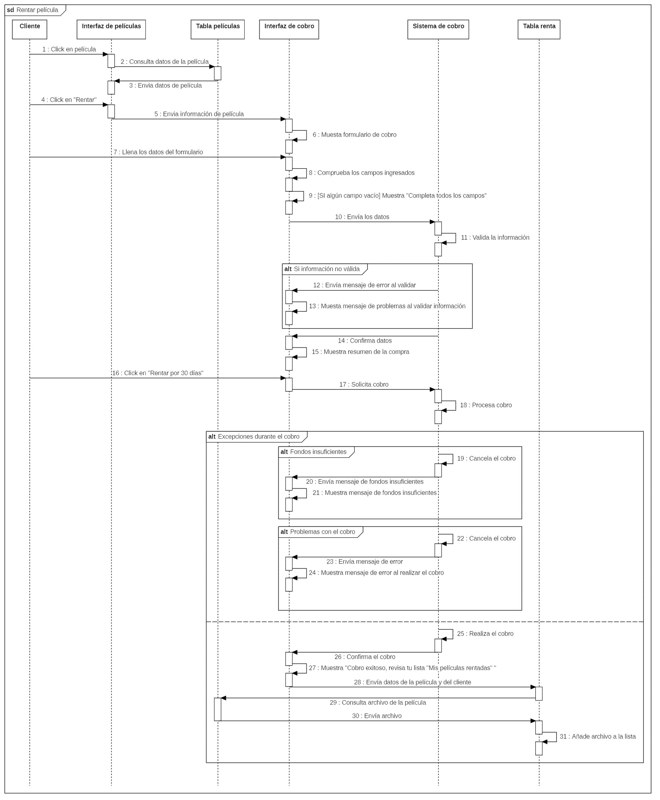
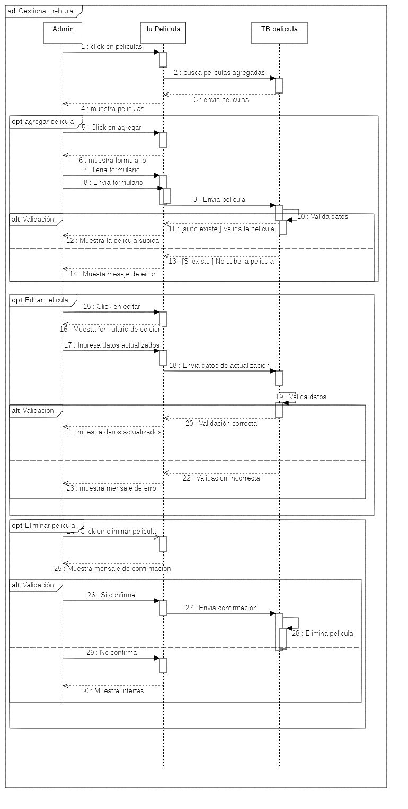
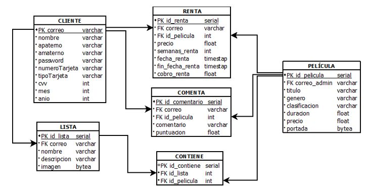
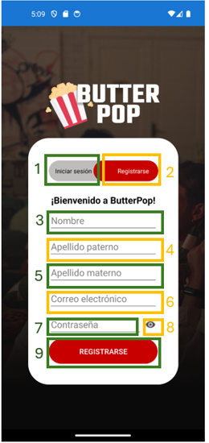
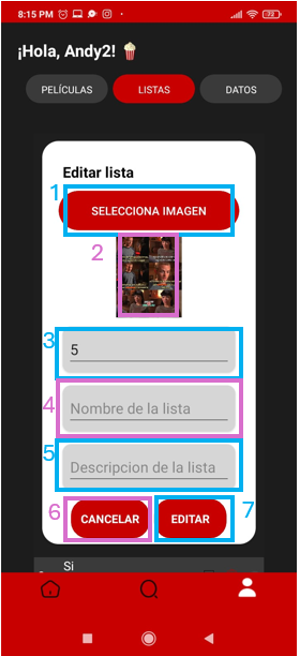
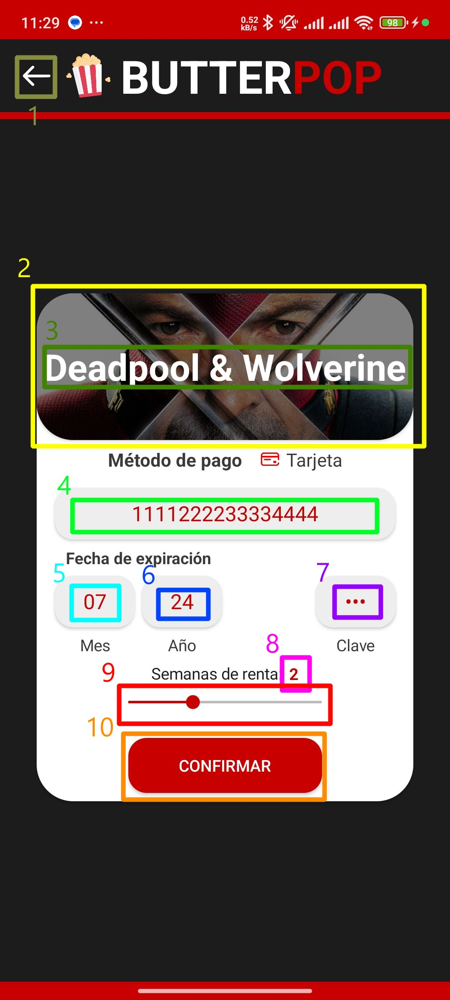

*`documento sujeto a cambios`*

### Cambios pendientes por realizar
#### Introduccion
- [ ] Agregar descripcion y abstract

#### Marco teorico
- [ ] Expandir el marco teorico una hoja mas

#### Diagrama general
- [ ] Comprobar el diagrama general

#### Capitulo 3
- [ ] Agregar introduccion al capitulo

---

# BUTTERPOP - DIGITAL DREAM INTEGRAGORA II REPORTE TÉCNICO

### PARA OBTENER EL TÍTULO DE
### TÉCNICO SUPERIOR UNIVERSITARIO EN TECNOLOGÍAS DE LA INFORMACIÓN ÁREA DESARROLLO DE SOFTWARE MULTIPLATAFORMA

*P R E S E N T A*

**ANDREA DOMÍNGEZ ZENTENO** 
**JESÚS MÍGUEL ROSALES MURILLO** 
**JOEL GONZÁLEZ CRUZ** 
**JOSÉ JULÁN MARTÍNEZ DE LA CRUZ** 

ASESORA DE LA ORGANIZACIÓN: DRA. MORAMAY RAMÍREZ HERNÁNDEZ 
ASESORA ACADÉMICA: LDA. SANDRA RAQUEL LÓPEZ ARCE SOROA 
ORGANIZACIÓN: "DIGITAL DREAM S.A. DE C.V." 
GENERACIÓN: ENERO 2023-DICIEMBRE 2024 
CUATRIMESTRE DE TÉRMINO: SEPTIEMBRE-DICIEMBRE 2024 

---

## ÍNDICE
- [RESUMEN](#resumen)
- [ABSTRACT](#abstract)
- [INTRODUCCIÓN](#introducción)
- [OBJETIVOS](#objetivos)
- [PROGRAMA Y CRONOGRAMA](#programa-y-cronograma)
- [MARCO TEÓRICO](#marco-teórico)
- [METODOLOGÍA](#metodología)
- [CAPÍTULO 1 RECOLECCIÓN Y REFINAMIENTO DE REQUISITOS](#capítulo-1-recolección-y-refinamiento-de-requisitos)
    - [Necesidades del cliente](#11-nececidades-del-cliente)
    - [Identificación y definición de roles de usuario](#12-identificación-y-definición-de-roles-de-usuario)
    - [Requerimientos funcionales](#13-requerimientos-funcionales)
    - [Requerimientos no funcionales](#14-requerimientos-no-funcionales)
    - [Requerimientos de hardware](#15-requerimientos-de-hardware)
    - [Requerimientos de software](#16-requerimientos-de-software)
    - [Diagrama general de casos de uso](#17-diagrama-general-de-casos-de-uso)
    - [Especificación de los casos de uso](#18-especificación-de-los-casos-de-uso)
    - [Diagramas de secuencia](#19-diagramas-de-secuencia)
    - [Diagrama de actividades](#110-diagrama-de-actividades)
- [CAPÍTULO 2 DISEÑO Y DESARROLLO DEL PROYECTO](#capítulo-2-diseño-y-desarrollo-del-proyecto)
    - [Diagrama de la base de datos (relacional)](#21-diagrama-de-la-base-de-datos-relacional)
    - [Diccionario de datos](#22-diccionario-de-datos)
    - [Diseño de pruebas](#23-diseño-de-pruebas)
    - [Diseño de las interfaces (maquetas)](#24-diseño-de-las-interfaces-maquetas)
- [CAPÍTULO 3 IMPLEMENTACIÓN Y PRUEBAS](#capítulo-3-implementación-y-pruebas)
- [DESARROLLADORES](#desarolladores)

## RESUMEN

## ABSTRACT

## INTRODUCCIÓN
Cinemas AJEM será una empresa mexicana líder en entretenimiento dedicada al desarrollo y operación de complejos múltiples de exhibición cinematográfica. Con más de 23 años en el mercado, se posicionará en el top 10 de las mejores cadenas cinematográficas del mundo, contando con 335 complejos y 2,898 pantallas en 98 ciudades de la República Mexicana.

El departamento de ventas de Cinemas AJEM se encargará no solo del manejo y control de todas las ventas registradas dentro del cine, sino que también participará en diversas actividades con el objetivo de promover la compra de sus servicios y productos por parte de los clientes, tales como la venta de comida, boletería, dulcería, etc.

Respecto a estas operaciones, existirá un problema relacionado al apartado de boletería, ya que con la llegada de las plataformas de streaming, su público fuente, prefiere ver películas vía online en lugar de acudir al cine, lo que reduce considerablemente sus ventas.

Basándose en este problema surgirá la necesidad de incrementar sus ventas por medio de una aplicación multiplataforma amigable, segura, estable y fácil de usar que permitirá a los usuarios, que no lograron ver la película en su momento, o que prefieran volver a disfrutar de ella desde la comodidad de su casa, la compra/renta de las películas disponibles en su cartelera.

La implementación de esta aplicación podría aumentar considerablemente las ventas de las proyecciones del cine, ya que, además de permitir la compra/renta de películas de manera fácil para los usuarios, también brindará una experiencia única a los clientes permitiéndoles opinar, organizar sus películas en listas de reproducción, además les permitirá acumular puntos para canjearlos por cupones o descuentos, motivando así una visita próxima a sus sucursales.

Debido a la necesidad mencionada anteriormente, la participación de desarrolladores técnicos universitarios en el área de desarrollo de software multiplataforma de la Universidad Tecnológica de Tecámac será la adecuada, ya que poseerán los conocimientos necesarios en diseño, codificación, almacenamiento y manejo de datos para desarrollar la aplicación de manera efectiva y brindar una solución a la reducción de ventas del cine.

El presente documento tendrá como objetivo mostrar, explicar y analizar el proceso de realización de la app. Estará dividido en tres capítulos de gran importancia, ya que cada uno proporcionará información detallada sobre cómo se desarrollará la aplicación multiplataforma.

El capítulo uno se enfocará en la recolección y refinamiento de los requisitos sugeridos por el cliente. Esto incluirá identificar y comprender sus necesidades, establecer los roles de usuario para la aplicación y definir los requerimientos funcionales y no funcionales del sistema. Esta sección servirá como base para determinar los requerimientos de software y hardware necesarios para la realización de la aplicación. Además, se presentarán los diagramas de caso de uso, secuencia y actividad para visualizar el funcionamiento del sistema y la interacción de los usuarios con cada una de las actividades de este.

En el capítulo dos se abordará el diseño y desarrollo del proyecto. Aquí se diseñará la base de datos con las tablas necesarias para gestionar cada parte del sistema, como películas, clientes, listas, etc. También se creará un diccionario de datos y se diseñarán las pruebas necesarias para asegurar el correcto funcionamiento de la aplicación. Además, se realizará el maquetado de cada una de las interfaces.

Finalmente, el capítulo tres se centrará en la implementación y pruebas de la aplicación. Se documentará todo lo relacionado con las interfaces diseñadas en el capítulo dos y se llevarán a cabo las pruebas para garantizar el funcionamiento adecuado del sistema.

## OBJETIVOS
### Objetivo general
Desarrollar una aplicación multiplataforma innovadora, amigable, segura e intuitiva que permita a los clientes de Cinemas AJEM comprar y rentar las películas más recientes de su cartelera desde la comodidad de sus hogares. La aplicación proporcionará una experiencia de usuario única al ofrecer funcionalidades como la creación de listas de reproducción, acumulación de puntos para descuentos, y la opción de dejar opiniones sobre las películas. Con el objetivo de revertir la tendencia a la baja en ventas debido a la popularidad de las plataformas de streaming, esta aplicación se posicionará como una solución integral para incrementar significativamente las ventas del cine y atraer a los usuarios que no lograron ver las películas en el cine o desean volver a disfrutar de ellas en cualquier momento durante el período de renta.

### Objetivos específicos
- Realizar la base de datos que almacene la información relacionada con los administradores, clientes y el catálogo de películas, lo cual será fundamental para la codificación y elaboración de las interfaces.
- Diseñar las interfaces de los administradores y clientes con un diseño práctico y atractivo, para posteriormente llevar a cabo las pruebas.
- Probar la funcionalidad de las interfaces y registrar los errores que puedan ocurrir, con el objetivo de solucionarlos rápidamente y entregar un trabajo de calidad.

## PROGRAMA Y CRONOGRAMA
| **UNIVERSIDAD TECNOLÓGICA DE TECÁMAC DIVISIÓN TIC PROGRAMA DE ESTADÍAS PROFESIONALES** |  |
| - | - |
| **PROGRAMA DE TRABAJO** | *FECHA: dd/mm/aaaa* |

### DATOS DEL O DE LA ESTUDIANTE
| NOMBRE: | Domínguez Zenteno Andrea González Cruz Joel Martínez de la Cruz José Julián Rosales Murillo Jesús Miguel  |
| - | - |
| DIVISIÓN: | Tecnologías de la Información y Comunicación |
| CARRERA: | Técnico Superior Universitario en Tecnologías de la Información Área Desarrollo de Software Multiplataforma |
| MATRÍCULA: | 2523260004 2523260021 2523260022 2523260068 |
| GENERACIÓN: | Enero 2023 – Diciembre 2024 |

### ASESORA ACADÉMICA
| NOMBRE: | Sandra Raquel López Arce Soroa |
| - | - |
| CARGO: | Profesora de Asignatura |

### DATOS DE LA ORGANIZACIÓN
| NOMBRE DE LA ORGANIZACIÓN: | Universidad Tecnológica de Tecámac |
| - | - |
| DEPARTAMENTO: | Tecnologías de la Información y Comunicación |
| ÁREA: | Desarrollo de Software Multiplataforma |
| DIRECCIÓN: | Carretera Federal México – Pachuca Km 37.5, 55749 Estado de México |
| TELÉFONO: | 55 6499 7632 |
| E-MAIL: | ditc@uttecamac.edu.mx |

### AESESORA DE LA ORGANIZACIÓN
| NOMBRE: | Moramay Ramírez Hernández |
| - | - |
| CARGO: | Profesora de Tiempo Completo |

### PERÍODO
| DURACIÓN: | 15 semanas |
| - | - |
| FECHA DE INICIO: | 01 de mayo de 2024 |
| FECHA DE TERMINACIÓN: | 15 de agosto de 2024 |
| HORARIO: | 10:00 am a 6:00 pm |

### PROYECTO
| NOMBRE: | BUTTERPOP |
| - | - | 
| DESCRIPCIÓN: | El presente proyecto consiste en la elaboración de una aplicación multiplataforma que sea auxiliar a la empresa Cinemas AJEM, con el fin de incrementar sus ventas y sea de alternativa a los clientes como una forma de ver películas en estreno. |
| OBJETIVO GENERAL: | Desarrollar una aplicación multiplataforma innovadora, amigable, segura e intuitiva que permita a los clientes de Cinemas AJEM comprar y rentar las películas más recientes de su cartelera desde la comodidad de sus hogares. La aplicación proporcionará una experiencia de usuario única al ofrecer funcionalidades como la creación de listas de reproducción, acumulación de puntos para descuentos, y la opción de dejar opiniones sobre las películas. Con el objetivo de revertir la tendencia a la baja en ventas debido a la popularidad de las plataformas de streaming, esta aplicación se posicionará como una solución integral para incrementar significativamente las ventas del cine y atraer a los usuarios que no lograron ver las películas en el cine o desean volver a disfrutar de ellas en cualquier momento durante el período de renta. |
| OBJETIVOS ESPECÍFICOS: | Realizar la base de datos que almacene la información relacionada con los administradores, clientes y el catálogo de películas, lo cual será fundamental para la codificación y elaboración de las interfaces.  Diseñar las interfaces de los administradores y clientes con un diseño práctico y atractivo, para posteriormente llevar a cabo las pruebas.  Probar la funcionalidad de las interfaces y registrar los errores que puedan ocurrir, con el objetivo de solucionarlos rápidamente y entregar un trabajo de calidad. |
| ALCANCE(S): | La aplicación podrá usarla administradores de Cinemas AJEM para la gestión de películas en estreno de temporada. De igual forma será adaptada a los usuarios que quieran una alternativa de rentar y/o comprar películas. |
| META(S): | La aplicación cumplirá en su totalidad con las expectativas del cliente, ayudando a la incrementación de sus ventas. |
| RECURSOS: | **Hardware:** Computadoras, memorias USB y router con conexión a internet. **Software:** Android Studio, Visual Studio, PostgreSQL, Testlink, MantisBT. |

### PLAN DE TRABAJO
<table>
    <tr>
        <td colspan="2" rowspan="2">ACTIVIDAD</td>
        <td rowspan="2">DESCRIPCION</td>
        <td colspan="2">SEMANA</td>
        <td colspan="2">FECHAS</td>
    </tr>
    <tr>
        <td>INICIO</td>
        <td>TERMINO</td>
        <td>INICIO</td>
        <td>TERMINO</td>
    </tr>
    <tr>
        <td>1</td>
        <td></td>
        <td>Recolección de Refinamiento y Requisitos</td>
        <td></td>
        <td></td>
        <td></td>
        <td></td>
    </tr>
    <tr>
        <td></td>
        <td>1.1</td>
        <td>Requerimientos del cliente</td>
        <td>1</td>
        <td>1</td>
        <td>07/05/2024</td>
        <td>10/05/2024</td>
    </tr>
    <tr>
        <td></td>
        <td>1.2</td>
        <td>Especificar el alcance del proyecto</td>
        <td>1</td>
        <td>1</td>
        <td>07/05/2024</td>
        <td>13//05/2024</td>
    </tr>
    <tr>
        <td></td>
        <td>1.3</td>
        <td>Preparación de Hardware y Software</td>
        <td>1</td>
        <td>1</td>
        <td>07/05/2024</td>
        <td>14/05/2024</td>
    </tr>
    <tr>
        <td></td>
        <td>1.4</td>
        <td>Especificación de casos de uso</td>
        <td>2</td>
        <td>2</td>
        <td>15/05/2024</td>
        <td>18/05/2024</td>
    </tr>
    <tr>
        <td></td>
        <td>1.5</td>
        <td>Diagrama de casos de uso</td>
        <td>2</td>
        <td>3</td>
        <td>17/05/2024</td>
        <td>24/05/2024</td>
    </tr>
    <tr>
        <td></td>
        <td>1.6</td>
        <td>Modelado de base de datos</td>
        <td>3</td>
        <td>4</td>
        <td>27/05/2024</td>
        <td>05/06/2024</td>
    </tr>
    <tr>
        <td></td>
        <td>1.7</td>
        <td>Programación de aplicación</td>
        <td>5</td>
        <td>8</td>
        <td>10/06/2024</td>
        <td>21/06/2024</td>
    </tr>
    <tr>
        <td></td>
        <td>1.8</td>
        <td>Diseño de interfaces</td>
        <td>8</td>
        <td>10</td>
        <td>22/06/2024</td>
        <td>06/07/2024</td>
    </tr>
    <tr>
        <td></td>
        <td>1.9</td>
        <td>Estrategia de avance de proyecto</td>
        <td>13</td>
        <td>13</td>
        <td>07/07/2024</td>
        <td>10/07/2024</td>
    </tr>
    <tr>
        <td></td>
        <td>1.10</td>
        <td>Implementación y pruebas</td>
        <td>13</td>
        <td>14</td>
        <td></td>
        <td></td>
    </tr>
    <tr>
        <td></td>
        <td>1.11</td>
        <td>Entrega de documentación final</td>
        <td>14</td>
        <td>15</td>
        <td></td>
        <td></td>
    </tr>
</table>

### CRONOGRAMA DE ACTIVIDADES (PROGRAMA)
<table>
    <tr>
        <td rowspan="2">#</td>
        <td rowspan="2">ACTIVIDADES</td>
        <td rowspan="2">CONTROL</td>
        <td colspan="5">Mes 1</td>
        <td colspan="4">Mes 2</td>
        <td colspan="4">Mes 3</td>
        <td colspan="2">Mes 4</td>
    </tr>
    <tr>
        <td>1</td>
        <td>2</td>
        <td>3</td>
        <td>4</td>
        <td>5</td>
        <td>6</td>
        <td>7</td>
        <td>8</td>
        <td>9</td>
        <td>10</td>
        <td>11</td>
        <td>12</td>
        <td>13</td>
        <td>14</td>
        <td>15</td>
    </tr>
    <tr>
        <td rowspan="2">1</td>
        <td rowspan="2">Exploración</td>
        <td>PROG.</td>
        <td>X</td>
        <td>X</td>
        <td></td>
        <td></td>
        <td></td>
        <td></td>
        <td></td>
        <td></td>
        <td></td>
        <td></td>
        <td></td>
        <td></td>
        <td></td>
        <td></td>
        <td></td>
    </tr>
    <tr>
        <td>REAL</td>
        <td>X</td>
        <td>X</td>
        <td></td>
        <td></td>
        <td></td>
        <td></td>
        <td></td>
        <td></td>
        <td></td>
        <td></td>
        <td></td>
        <td></td>
        <td></td>
        <td></td>
        <td></td>
    </tr>
    <tr>
        <td rowspan="2">2</td>
        <td rowspan="2">Iniciación</td>
        <td>PROG.</td>
        <td></td>
        <td></td>
        <td>X</td>
        <td>X</td>
        <td>X</td>
        <td></td>
        <td></td>
        <td></td>
        <td></td>
        <td></td>
        <td></td>
        <td></td>
        <td></td>
        <td></td>
        <td></td>
    </tr>
    <tr>
        <td>REAL</td>
        <td></td>
        <td></td>
        <td>X</td>
        <td>X</td>
        <td>X</td>
        <td></td>
        <td></td>
        <td></td>
        <td></td>
        <td></td>
        <td></td>
        <td></td>
        <td></td>
        <td></td>
        <td></td>
    </tr>
    <tr>
        <td rowspan="2">3</td>
        <td rowspan="2">Producto</td>
        <td>PROG.</td>
        <td></td>
        <td></td>
        <td></td>
        <td></td>
        <td></td>
        <td>X</td>
        <td>X</td>
        <td>X</td>
        <td></td>
        <td></td>
        <td></td>
        <td></td>
        <td></td>
        <td></td>
        <td></td>
    </tr>
    <tr>
        <td>REAL</td>
        <td></td>
        <td></td>
        <td></td>
        <td></td>
        <td></td>
        <td>X</td>
        <td>X</td>
        <td>X</td>
        <td></td>
        <td></td>
        <td></td>
        <td></td>
        <td></td>
        <td></td>
        <td></td>
    </tr>
    <tr>
        <td rowspan="2">4</td>
        <td rowspan="2">Estabilización</td>
        <td>PROG.</td>
        <td></td>
        <td></td>
        <td></td>
        <td></td>
        <td></td>
        <td></td>
        <td></td>
        <td></td>
        <td>X</td>
        <td>X</td>
        <td>X</td>
        <td>X</td>
        <td></td>
        <td></td>
        <td></td>
    </tr>
    <tr>
        <td>REAL</td>
        <td></td>
        <td></td>
        <td></td>
        <td></td>
        <td></td>
        <td></td>
        <td></td>
        <td></td>
        <td>X</td>
        <td>X</td>
        <td>X</td>
        <td>X</td>
        <td></td>
        <td></td>
        <td></td>
    </tr>
    <tr>
        <td rowspan="2">5</td>
        <td rowspan="2">Pruebas</td>
        <td>PROG.</td>
        <td></td>
        <td></td>
        <td></td>
        <td></td>
        <td></td>
        <td></td>
        <td></td>
        <td></td>
        <td></td>
        <td></td>
        <td></td>
        <td></td>
        <td>X</td>
        <td>X</td>
        <td>X</td>
    </tr>
    <tr>
        <td>REAL</td>
        <td></td>
        <td></td>
        <td></td>
        <td></td>
        <td></td>
        <td></td>
        <td></td>
        <td></td>
        <td></td>
        <td></td>
        <td></td>
        <td></td>
        <td>X</td>
        <td>X</td>
        <td>X</td>
    </tr>
</table>

### FIRMAS
<table>
    <tr>
        <td colspan="2">
            Dra. Moramay Ramírez Hernández 
            <em>ASESORA DE LA ORGANIZACIÓN</em>
        </td>
    </tr>
    <tr>
        <td>
            Andrea Domínguez Zenteno 
            Jesús Miguel Rosales Murillo 
            Joel González Cruz 
            José Julián Martínez de la Cruz  
            <em>ESTUDIANTE</em>
        </td>
        <td>
            Lda. Sandra Raquel López Arce Soroa 
            <em>ASESORA ACADÉMICA</em>
        </td>
    </tr>
</table>

## MARCO TEÓRICO
Una aplicación multiplataforma es una pieza de software diseñada para funcionar en múltiples sistemas operativos y dispositivos sin la necesidad de diseñar versiones diferentes para cada plataforma. Esto significa que el mismo código fuente puede ser usado en diferentes entornos, tales como: Android, iOS, Windows, macOS, Linux, entre otros.

En los años 90's, estas aplicaciones surgen como respuesta a la necesidad de las empresas de alcanzar una audiencia más amplia, reducir costos y tiempo de desarrollo. Algunas de las razones por las cuales se usan aplicaciones multiplataforma son:

- **Diversidad de dispositivos y sistemas operativos** 
Con la proliferación de dispositivos móviles y una amplia variedad de sistemas operativos, presenta el desafío de desarrollar aplicaciones nativas para cada una de las plataformas, lo que implica disponer de múltiples equipos de desarrollo, lo que significaba mayores costos y cantidad de tiempo para las empresas en desarrollar dicha aplicación para cada plataforma.

- **Eficiencia en el desarrollo** 
Desarrollar una aplicación para cada plataforma es costoso, lento e ineficiente. Las aplicaciones multiplataforma permiten escribir un único código fuente y reutilizarlo en múltiples entornos dependiendo de las necesidades y capacidades del dispositivo. Esto acelera en gran medida el desarrollo, facilita el mantenimiento y reduce los costos de la aplicación.

- **Tecnologías web y móviles** 
El desarrollo de lenguajes, frameworks y herramientas han hecho posible la creación de aplicaciones eficientes en diversas plataformas. estas tecnologías permiten a los desarrolladores acceder a características nativas de cada sistema operativo con un solo código fuente.

- **Demanda del mercado** 
Los consumidores esperan que las aplicaciones estén disponibles en sus dispositivos y estos mismos pueden variar de persona a persona. Las empresas desean llegar a audiencias cada vez más grandes, por lo que necesitan asegurarse de que sus aplicaciones estén disponibles para la mayor cantidad de dispositivos y plataformas posibles para así cumplir con los objetivos planteados por la propia empresa.

Para el desarrollo de este proyecto se utilizarán diversos lenguajes de programación y herramientas de diseño y prueba que permitirán la implementación de la lógica del cliente y las funcionalidades esenciales de la aplicación multiplataforma, entre las cuales se incluyen:

- **Visual Studio**

Microsoft Visual Studio es un entorno de desarrollo integrado (IDE, por sus siglas en inglés) para Windows y macOS. Es compatible con múltiples lenguajes de programación, tales como C++, C#, Fortran, Visual Basic .NET, F#, Java, Python, Ruby y PHP, al igual que entornos de desarrollo web, como ASP.NET MVC, Django, etc.

Se hará uso de este entorno para desarrollar la aplicación, compilar y depurarla.

- **Xamarin**

Es un marco de interfaz de usuario de código abierto. Xamarin.froms permite a los desarrolladores compilar aplicaciones en Xamarin, Android y xamarin.ios y Windows desde un código base compartido. Xamarin.forms permite a los desarrolladores crear interfaces de usuario XAML con código subyacente en C#. Estas interfaces se representan como controles nativos con mejor rendimiento en cada plataforma.

Se utilizará este Framework ya que es requisito que la aplicación sea multiplataforma, usando como entorno de desarrollo Android Studio para posteriormente ser compilada a diversos sistemas operativos móviles de manera sencilla, rápida y eficiente.

- **C#**

Es un lenguaje de programación multiparadigma desarrollado por Microsoft, que evoluciona de la familia de lenguajes C, toma lo mejor de los lenguajes C y C++, los cuales se asemejan mucho a lenguajes de alto nivel de abstracción como Java y JavaScript. Forma parte de la plataforma .NET de Microsoft.

Se usará este lenguaje de programación para desarrollar un código general, el cual posteriormente será compilado por XAMARIN para Android e iOS.

- **XAML**

El lenguaje de marcado de aplicaciones extensible (XAML) es un lenguaje declarativo. En concreto, XAML puede inicializar objetos y establecer propiedades de objetos mediante una estructura de lenguaje que muestra relaciones jerárquicas entre varios objetos y una convención de tipo de respaldo que admite la extensión de tipos. Puedes crear elementos visibles de la interfaz de usuario en el marcado XAML declarativo. A continuación, puedes asociar un archivo de código subyacente distinto para cada archivo XAML que puede responder a eventos y manipular los objetos que originalmente declares en XAML.

Se empleará este lenguaje de marcado para diseñar las interfaces de la aplicación.

- **SQLite**

Es un sistema de gestión de bases de datos relacional compatible con ACID, está escrita en C. A diferencia de los sistemas de gestión de bases de datos cliente-servidor, el motor de SQLite no es un proceso independiente con el que el programa principal se comunica. En lugar de eso, la biblioteca SQLite se enlaza con el programa pasando a ser parte integral del mismo. El programa utiliza la funcionalidad de SQLite a través de llamadas simples a subrutinas y funciones. Esto reduce la latencia en el acceso a la base de datos, debido a que las llamadas a funciones son más eficientes que la comunicación entre procesos.

Se empleará este gestor de base de datos para almacenar y procesar la información necesaria para la ejecución de la aplicación "BUTTERPOP".

- **Git**

Es un sistema de control de versiones distribuido, cada desarrollador tiene una copia integral del mismo. A diferencia de los sistemas de control de versiones centralizados los DVCS necesitan una conexión constante a un repositorio central. Git es un sistema de control de versiones distribuido más popular y se utiliza el desarrollo de proyectos de código abierto.

Se hará uso de esta herramienta para facilitar y agilizar un flujo colaborativo para el equipo, además de mejorar el versionado del proyecto y aumentar la eficiencia de correcciones, implementaciones y reducir tiempos de desarrollo.

- **Visual Studio Code**

Es un editor de código fuente desarrollado por Microsoft para Windows, Linux, macOS y Web. Incluye soporte para la depuración, control integrado de Git, resaltado de sintaxis, finalización inteligente de código, fragmentos y refactorización de código. También es personalizable, por lo que los usuarios pueden cambiar el tema del editor, los atajos de teclado y las preferencias. Es gratuito y de código abierto,12 aunque la descarga oficial está bajo software privativo e incluye características personalizadas por Microsoft.

Se empleará este editor de código para la edición de archivos ligeros como archivos markdown o md y asistencia en resolución de conflictos de merge en git.

- **StarUML**

Es un sofisticado modelador de software destinado a soportar un modelado ágil y conciso.

Se utilizará este programa para modelar diagramas de casos de uso, de secuencia, actividades, entre otros, para sustentar el desarrollo del proyecto.

- **Figma**

Figma es un editor de gráficos vectoriales y una herramienta de generación de prototipos, principalmente basada en la web, con características offline adicionales habilitadas por aplicaciones de escritorio en macOS y Windows. Permite a los diseñadores colaborar en tiempo real, lo cual es ideal para equipos distribuidos geográficamente. Esta herramienta es conocida por su capacidad de mantener un flujo de trabajo eficiente gracias a sus funciones de coedición y comentarios en vivo. Además, Figma soporta la creación de componentes reutilizables, lo que facilita la consistencia en el diseño de la interfaz de usuario.

Se usará este programa para realizar el maquetado del diseño de interfaces.

- **Dia**

Dia es una aplicación informática de propósito general para la creación de diagramas, creada originalmente por Alexander Larsson,1​ y desarrollada como parte del proyecto GNOME. Está concebido de forma modular, con diferentes paquetes de formas para diferentes necesidades.

Se usará este programa para modelar el modelo relacional de la base de datos de "BUTTERPOP".

## METODOLOGÍA
Dentro del ámbito del desarrollo de aplicaciones móviles, elegir una metodología se toma de gran importancia, debido a que el equipo se puede sincronizar y planificar las fases del proyecto con mayor facilidad.

La metodología implementada a este proyecto es Mobile-D dada la preferencia en aplicaciones móviles y que está enfocada a equipos de menor tamaño para lograr ciclos de desarrollo muy rápidos. En el proyecto, es conveniente tener este tipo de metodología ágil para lapsos de tiempo cortos.

Las fases de Mobile-D se basan en un modelo de planificación y entrega:

Fase de exploración: Aquí se define el alcance del proyecto con planificación y atención a los conceptos básicos del proyecto. Nuestra aplicación se enfoca al mundo del entretenimiento, por lo que conocer las funcionalidades cercanas a los usuarios no es complejo.

Fase de iniciación: En esta fase, se preparan los materiales, software y hardware para empezar el proyecto, teniendo un plazo de planificación y el resto de trabajo.

Fase de producto: De igual manera, se tiene un plazo de planeación como retroalimentación de lo anterior y definición de al menos una prueba que verifique el funcionamiento del proyecto. Seguido, se tiene un último plazo de trabajo enfocado en la implementación, equivalente al código y diseño de la aplicación por módulo.

Fase de estabilización: Se realiza la integración del proyecto, es decir, módulos separados que deben juntarse para tener una versión completa del proyecto. Así mismo, se entrega documentación del proyecto en donde se describan y exhiban los pasos y descripciones de todo el desarrollo de la aplicación.

Fase de pruebas: Una vez pasada una prueba general de la aplicación, se llega a un plazo de testeo hasta llegar a una versión adecuada a las necesidades del cliente y funcionalidades requeridas por el mismo. Se corrigen fallos, se documentan, pero no se agrega más funcionalidades.

---
## CAPÍTULO 1 RECOLECCIÓN Y REFINAMIENTO DE REQUISITOS
El primer capítulo contiene la definición y especificación de los usuarios que usarán la aplicación, así como los requisitos funcionales y no funcionales del mismo, además del software y hardware necesario para desarrollar dicha aplicación. También se especifican los procesos generales de cada caso de uso con su respectivo diagrama de secuencia en cada caso.

### 1.1 Nececidades del cliente
El departamento de ventas de Cinemas AJEM necesita una aplicación multiplataforma llamada "ButterPop" que abarque tanto la compra y renta de las películas más recientes de su cartelera, como la interacción con los usuarios, brindándoles una experiencia amigable. Por lo que proponen que la misma cuente con dos interfaces clave para lograr esto. 

La primera interfaz está destinada a administradores y superadministradores. Permite la gestión eficiente del catálogo de películas del cine. Los administradores pueden introducir información como la imagen relacionada a la película, el género, duración, título, clasificación, y precio.

La segunda interfaz está diseñada para mejorar la experiencia de los usuarios. Permitiéndoles registrarse, consultar el catálogo de películas, la compra/renta de estas, la creación de listas de reproducción o colecciones de sus películas favoritas o películas pendientes por ver, puntuar y comentar, así como permitirles la obtención de puntos.

El acceso a ambas interfaces depende de un mismo login, sin embargo, para acceder como administradores deben hacerlo por medio de usuarios previamente creados de manera manual por los superadministradores.

### 1.2 Identificación y definición de roles de usuario
Dentro de la aplicación "ButterPop" existen dos roles de usuario fundamentales para el correcto funcionamiento de esta.
- Cliente: Este usuario se tendrá que registrar por medio de correo electrónico y contraseña, e iniciar sesión para poder rentar, comentar, puntuar o guardar una película en alguna lista. Sobre las listas, el usuario podrá crear diferentes dependiendo de sus necesidades. Para poder rentar una película, el cliente tendrá que vincular una forma de pago para poder adquirir la película.
- Administrador: El administrador será el responsable de la gestión de la aplicación "pendiente" de manera que pueda manipular la base de datos para la gestión de películas, usuarios y las rentas que el usuario realice.

### 1.3 Requerimientos funcionales
Los requerimientos funcionales son aquellas descripciones del sistema que tienen una funcionalidad para satisfacer al usuario.
- Registro de clientes: El sistema deberá permitir el registro de clientes interesados con correo y contraseña como parte del registro.
- Inicio de sesión de clientes: El sistema deberá permitir el inicio de sesión de clientes con su correo y contraseña previamente registradas.
- Renta de películas: El sistema deberá permitir la renta de películas en estreno a usuarios registrados en la aplicación siempre y cuando vinculen un método de pago.
- Comentar y puntuar: El sistema deberá permitir a los usuarios con cuenta puntuar las películas, así como comentarlas.
- Gestionar listas: El sistema deberá permitir a los usuarios visualizar, crear, eliminar o actualizar listas personalizables en donde puedan guardar películas.
- Inicio de sesión de administradores: El sistema deberá permitir a los administradores iniciar sesión con un correo y contraseña previamente registrada en la base de datos.
- Gestionar películas: El sistema deberá permitir a los administradores agregar, actualizar y eliminar películas.

### 1.4 Requerimientos no funcionales
Los requerimientos no funcionales son aquellas descripciones que determinan como debe comportarse el sistema en cuestión de calidad y características.
- Encriptar datos: El sistema deberá encriptar datos sensibles tanto del administrador como el cliente, por ejemplo, contraseñas e información bancaria.
- Tiempo de respuesta: El sistema deberá tener un tiempo de respuesta entre cada actividad de máximo cinco segundos.
- Diferenciación administrador y cliente: El sistema deberá diferenciar el inicio de sesión entre un cliente y un administrador.
- Diseño: El sistema deberá tener un diseño responsivo, agradable a la vista del cliente en cuanto a color, tipografía y acorde a la aplicación.
- Usabilidad: El sistema deberá ser de fácil navegación a los usuarios.

### 1.5 Requerimientos de hardware
- Computadoras con mínimo de 16gb RAM y 1TB de almacenamiento. Con monitor de mínimo 22 pulgadas y procesador Intel Core i5 6ta Gen. Para uso general en el proyecto, programación, diseño y documentación.
- Memorias USB de mínimo 8gb de almacenamiento de la marca Kingston. Se utilizarán como medio de guardado de archivos móviles.
- Router o modem de cualquier compañía que ofrezca velocidad de internet de mínimo 61,82 Mb/s.

### 1.6 Requerimientos de software
- Conexión a internet por medio del router con mínima velocidad de 61,82 Mb/s.
- PostgreSQL: Será el gestor de base de datos del proyecto, dada la estructura que facilita a las bases de datos relacionales.
- Visual Studio: Para el desarrollo general de la aplicación, así como su compilación y depuración.
- Xamarin: Para la compilación de la aplicación en plataformas móviles como Android e iOS.
- Testlink: Gestor de casos de prueba en función de requisitos del cliente.
- MantisBT: Funcionará como gestor de reportes de errores o fallos de funcionalidad u ortográficos.

### 1.7 Diagrama general de casos de uso
*La figura 1.7.1 representa el diagrama general de casos de uso que muestran las gestiones principales de la aplicación.*

### 1.8 Especificación de los casos de uso
*La figura 1.8.1 muestra las secuencias del registro de un usuario.*
<table>
    <tr>
        <td>CU-0001</td>
        <td colspan="2">Registrar usuario</td>
    </tr>
    <tr>
        <td>Versión</td>
        <td colspan="2">1.0 (15/05/24)</td>
    </tr>
    <tr>
        <td>Autores</td>
        <td colspan="2">Martínez de la Cruz José Julián</td>
    </tr>
    <tr>
        <td>Actores</td>
        <td colspan="2">Cliente</td>
    </tr>
    <tr>
        <td>Rependencias</td>
        <td colspan="2">Ninguna</td>
    </tr>
    <tr>
        <td>Descripción</td>
        <td colspan="2">El sistema deberá comportarse tal cual se describe en el siguiente caso de uso cuando el usuario registra una cuenta en la aplicación multiplataforma</td>
    </tr>
    <tr>
        <td>Precondición</td>
        <td colspan="2">El usuario deberá visualizar la pantalla principal y la aplicación debe estar activa</td>
    </tr>
    <tr>
        <td rowspan="9">Flujo normal</td>
        <td>Paso</td>
        <td>Acción</td>
    </tr>
    <tr>
        <td>1</td>
        <td>El usuario da clic en el botón "Registrarse"</td>
    </tr>
    <tr>
        <td>2</td>
        <td>El sistema muestra el formulario de registro</td>
    </tr>
    <tr>
        <td>3</td>
        <td>El usuario ingresa su nombre</td>
    </tr>
    <tr>
        <td>4</td>
        <td>El usuario ingresa su correo electrónico</td>
    </tr>
    <tr>
        <td>5</td>
        <td>El usuario ingresa su contraseña</td>
    </tr>
    <tr>
        <td>6</td>
        <td>El usuario confirma su contraseña</td>
    </tr>
    <tr>
        <td>7</td>
        <td>El sistema valida los datos</td>
    </tr>
    <tr>
        <td>8</td>
        <td>El usuario da clic en el botón "Registrarme"</td>
    </tr>
    <tr>
        <td rowspan="2">Flujo alternativo</td>
        <td>Paso</td>
        <td>Acción</td>
    </tr>
    <tr>
        <td>7.1</td>
        <td>Si existe falta de datos, invalidación de datos o el correo electrónico ya ha sido registrado anteriormente, el sistema muestra el mensaje "Tu cuenta no pudo crearse con éxito" y manda al usuario a la interfaz de registrar cuenta, a continuación, este caso de uso queda sin efecto.</td>
    </tr>
    <tr>
        <td>Postcondición</td>
        <td colspan="2">Se guardan los datos de la nueva cuenta en la base de datos y el sistema manda al usuario a la interfaz principal.</td>
    </tr>
</table>

---

*La figura 1.8.2 muestra las secuencias del inicio de sesión de un usuario.*
<table>
    <tr>
        <td>CU-0002</td>
        <td colspan="2">Iniciar sesión</td>
    </tr>
    <tr>
        <td>Versión</td>
        <td colspan="2">1.0 (15/05/24)</td>
    </tr>
    <tr>
        <td>Autores</td>
        <td colspan="2">Martínez de la Cruz José Julián</td>
    </tr>
    <tr>
        <td>Actores</td>
        <td colspan="2">Cliente, Administrador</td>
    </tr>
    <tr>
        <td>Rependencias</td>
        <td colspan="2">Ninguna</td>
    </tr>
    <tr>
        <td>Descripción</td>
        <td colspan="2">El sistema deberá comportarse tal cual se describe en el siguiente caso de uso cuando el usuario inicia sesión en la aplicación multiplataforma.</td>
    </tr>
    <tr>
        <td>Precondición</td>
        <td colspan="2">El usuario debe contar con una cuenta previamente registrada.</td>
    </tr>
    <tr>
        <td rowspan="7">Flujo normal</td>
        <td>Paso</td>
        <td>Acción</td>
    </tr>
    <tr>
        <td>1</td>
        <td>El usuario da clic en el botón "Iniciar sesión"</td>
    </tr>
    <tr>
        <td>2</td>
        <td>El sistema muestra el formulario de inicio de sesión</td>
    </tr>
    <tr>
        <td>3</td>
        <td>El usuario ingresa su correo electrónico</td>
    </tr>
    <tr>
        <td>4</td>
        <td>El usuario ingresa su contraseña</td>
    </tr>
    <tr>
        <td>5</td>
        <td>El sistema valida los datos</td>
    </tr>
    <tr>
        <td>6</td>
        <td>El usuario da clic en el botón "Acceder"</td>
    <tr>
        <td rowspan="3">Flujo alternativo</td>
        <td>Paso</td>
        <td>Acción</td>
    </tr>
    <tr>
        <td>4.1</td>
        <td>Si el usuario ingresa datos no válidos, el sistema cancela el inicio de sesión, y muestra el mensaje "Correo electrónico o contraseña incorrectos", a continuación, este caso de uso queda sin efecto.</td>
    </tr>
    <tr>
        <td>6.1</td>
        <td>Si el sistema no encuentra una cuenta registrada, el sistema cancela su ingreso, y muestra el mensaje "Parece que la cuenta ingresada no existe. Vuelve a intentarlo" , a continuación, este caso de uso queda sin efecto.</td>
    </tr>
    <tr>
        <td>Postcondición</td>
        <td colspan="2">El sistema manda al usuario a la interfaz principal.</td>
    </tr>
</table>

---

*La figura 1.8.3 muestra las secuencias y gestión de rentar una película.*
<table>
    <tr>
        <td>CU-0003</td>
        <td colspan="2">Rentar película</td>
    </tr>
    <tr>
        <td>Versión</td>
        <td colspan="2">2.0 (18/07/24)</td>
    </tr>
    <tr>
        <td>Autores</td>
        <td colspan="2">González Cruz Joel</td>
    </tr>
    <tr>
        <td>Actores</td>
        <td colspan="2">Cliente</td>
    </tr>
    <tr>
        <td>Dependencias</td>
        <td colspan="2">Ninguna</td>
    </tr>
    <tr>
        <td>Descripción</td>
        <td colspan="2">El sistema le permitirá al usuario rentar una o más películas de su elección durante 1 hasta 4 semanas para que el cliente pueda poseerlas durante ese tiempo, posterior al plazo, el acceso a la película se revocará.</td>
    </tr>
    <tr>
        <td>Precondición</td>
        <td colspan="2">El cliente deberá haber iniciado sesión.</td>
    </tr>
    <tr>
        <td rowspan="14">Flujo normal</td>
        <td>Paso</td>
        <td>Acción</td>
    </tr>
    <tr>
        <td>1</td>
        <td>El usuario selecciona la película que desee rentar.</td>
    </tr>
    <tr>
        <td>2</td>
        <td>El sistema muestra la información de la película y costo de la renta por semana.</td>
    </tr>
    <tr>
        <td>3</td>
        <td>El usuario da click en el botón "Rentar".</td>
    </tr>
    <tr>
        <td>4</td>
        <td>El sistema mostrará un formulario de método de pago para rentar la película.</td>
    </tr>
    <tr>
        <td>5</td>
        <td>El usuario llena la información con sus datos bancarios.</td>
    </tr>
    <tr>
        <td>6</td>
        <td>El usuario selecciona la cantidad de semanas de renta, estos pueden ser: 1, 2, 3, o 4 semanas</td>
    </tr>
    <tr>
        <td>7</td>
        <td>El sistema valida la información ingresada.</td>
    </tr>
    <tr>
        <td>8</td>
        <td>El sistema genera la información necesaria para completar la renta. Para calcular el precio de renta lo hará como la sumatoria del precio, sobre la semana cuadrada menos 1</td>
    </tr>
    <tr>
        <td>9</td>
        <td>El sistema muestra un resumen de la película a rentar, bajo que cuenta se va a rentar y con que método de pago se hará la compra.</td>
    </tr>
    <tr>
        <td>10</td>
        <td>El usuario verificará la información y dará click en el botón "Rentar"</td>
    </tr>
    <tr>
        <td>11</td>
        <td>El sistema realizará el cobro bajo el concepto "BUTTERPOP - renta - {nombre de la película}, {cantidad de semanas} semanas"</td>
    </tr>
    <tr>
        <td>12</td>
        <td>El sistema creará un registro de información sobre la operación realizada y lo almacenará en una base de datos</td>
    </tr>
    <tr>
        <td>13</td>
        <td>El sistema mostrará un mensaje: "Transacción realizada exitosamente, revisa tu lista privada 'mis películas rentadas' o haz click aquí para ver la película que acabas de rentar".</td>
    </tr>
    <tr>
        <td rowspan="6">Flujo alternativo</td>
        <td>Paso</td>
        <td>Acción</td>
    </tr>
    <tr>
        <td>5.1</td>
        <td>En caso de que exista información bancaria del cliente, se rellenarán los datos del formulario automáticamente</td>
    </tr>
    <tr>
        <td>5.2</td>
        <td>En caso de que algún campo este vacío el sistema mostrará que todos los campos son requeridos</td>
    </tr>
    <tr>
        <td>7.1</td>
        <td>En caso de los datos ingresados no se puedan validar mostrará un mensaje indicando que ocurrió un problema al verificar los datos</td>
    </tr>
    <tr>
        <td>11.1</td>
        <td>En caso de que el método de pago no posea con los fondos suficientes, el sistema cancelará la transacción y notificara al usuario de que sus fondos son insuficientes</td>
    </tr>
    <tr>
        <td>11.2</td>
        <td>En caso de que el sistema no pueda completar la transacción, mostrará al cliente un mensaje de error: "No se ha podido realizar la operación, comprueba el estado de tu método de pago"</td>
    </tr>
    <tr>
        <td>Postcondición</td>
        <td colspan="2">El link de la película se agregará a una lista privada de "mis películas rentadas" al cliente</td>
    </tr>
</table>

---

*La figura 1.8.4 muestra las secuencias y gestión de comentar una película.*
<table>
    <tr>
        <td>CU-0004</td>
        <td colspan="2">Comentar película</td>
    </tr>
    <tr>
        <td>Versión</td>
        <td colspan="2">1.1 (23/06/24)</td>
    </tr>
    <tr>
        <td>Autores</td>
        <td colspan="2">Rosales Murillo Jesús Miguel</td>
    </tr>
    <tr>
        <td>Actores</td>
        <td colspan="2">Cliente</td>
    </tr>
    <tr>
        <td>Dependencias</td>
        <td colspan="2">Ninguna</td>
    </tr>
    <tr>
        <td>Descripción</td>
        <td colspan="2">El sistema deberá permitir a los usuarios comentar las películas que hayan visto en su respectiva sección y poder visualizar los comentarios de cada película.</td>
    </tr>
    <tr>
        <td>Precondición</td>
        <td colspan="2">El usuario deberá haber visto la película en cuestión previamente y encontrarse en el apartado de películas.</td>
    </tr>
    <tr>
        <td rowspan="19">Flujo normal</td>
        <td>Paso</td>
        <td>Acción</td>
    </tr>
    <tr>
        <td>1</td>
        <td>El usuario deberá darle clic en el botón comentar.</td>
    </tr>
    <tr>
        <td>2</td>
        <td>El sistema muestra la interfaz del apartado comentar.</td>
    </tr>
    <tr>
        <td>3</td>
        <td>El usuario rellenará con sus palabras la caja de comentario.</td>
    </tr>
    <tr>
        <td>4</td>
        <td>El usuario deberá darle clic en guardar.</td>
    </tr>
    <tr>
        <td>5</td>
        <td>El sistema le mostrará el mensaje de comentario insertado.</td>
    </tr>
    <tr>
        <td colspan="2">Modificar comentario</td>
    </tr>
    <tr>
        <td>6</td>
        <td>El caso de uso comienza cuando el usuario clickea en la opción "Editar" en su comentario.</td>
    </tr>
    <tr>
        <td>7</td>
        <td>El sistema muestra la interfaz del apartado comentar con una caja para ingresar texto.</td>
    </tr>
    <tr>
        <td>8</td>
        <td>El usuario ingresará su nuevo comentario en la caja de comentario.</td>
    </tr>
    <tr>
        <td>9</td>
        <td>El usuario deberá darle clic en "Guardar".</td>
    </tr>
    <tr>
        <td>10</td>
        <td>El sistema guarda el comentario modificado</td>
    </tr>
    <tr>
        <td>11</td>
        <td>El sistema muestra el comentario modificado.</td>
    </tr>
    <tr>
        <td colspan="2">Eliminar comentario</td>
    </tr>
    <tr>
        <td>12</td>
        <td>El caso de uso comienza cuando el usuario clickea en la opción "Borrar" en la sección "Editar" de su comentario.</td>
    </tr>
    <tr>
        <td>13</td>
        <td>El sistema muestra la interfaz de eliminar comentario, donde se le preguntará "¿Está seguro de querer borrar su comentario?".</td>
    </tr>
    <tr>
        <td>14</td>
        <td>El usuario deberá seleccionar la opción "BORRAR".</td>
    </tr>
    <tr>
        <td>15</td>
        <td>El sistema eliminará el comentario.</td>
    </tr>
    <tr>
        <td>16</td>
        <td>El sistema actualizará los comentarios.</td>
    </tr>
    <tr>
        <td rowspan="4">Flujo alternativo</td>
        <td>Paso</td>
        <td>Acción</td>
    </tr>
    <tr>
        <td>6.1</td>
        <td>Si el usuario no ha visto la película, no podrá comentar respecto a ella, apareciéndose un mensaje de error "No es posible comentar si no has visto la película".</td>
    </tr>
    <tr>
        <td>7.1</td>
        <td>Si el usuario selecciona "Cancelar", no se realizarán cambios en su comentario.</td>
    </tr>
    <tr>
        <td>12.1</td>
        <td>Si el usuario selecciona "Cancelar", no se borrará su comentario.</td>
    </tr>
    <tr>
        <td>Postcondición</td>
        <td colspan="2">Los comentarios ingresados se almacenan en la base de datos para que cualquiera pueda visualizarlos.</td>
    </tr>
</table>

---

*La figura 1.8.5 muestra las secuencias y gestión de puntuar una película.*
<table>
    <tr>
        <td>CU-0005</td>
        <td colspan="2">Puntuar película</td>
    </tr>
    <tr>
        <td>Versión</td>
        <td colspan="2">1.1 (23/06/24)</td>
    </tr>
    <tr>
        <td>Autores</td>
        <td colspan="2">Rosales Murillo Jesús Miguel</td>
    </tr>
    <tr>
        <td>Actores</td>
        <td colspan="2">Cliente</td>
    </tr>
    <tr>
        <td>Dependencias</td>
        <td colspan="2">Ninguna</td>
    </tr>
    <tr>
        <td>Descripción</td>
        <td colspan="2">El sistema deberá permitir a los usuarios puntuar las películas que hayan visto en su respectiva sección y poder visualizar las puntuaciones de cada película.</td>
    </tr>
    <tr>
        <td>Precondición</td>
        <td colspan="2">El usuario deberá haber visto la película en cuestión previamente y encontrarse en el apartado de películas.</td>
    </tr>
    <tr>
        <td rowspan="14">Flujo normal</td>
        <td>Paso</td>
        <td>Acción</td>
    </tr>
    <tr>
        <td>1</td>
        <td>El usuario deberá darle clic en el botón puntuar.</td>
    </tr>
    <tr>
        <td>2</td>
        <td>El sistema muestra la interfaz del apartado puntuar.</td>
    </tr>
    <tr>
        <td>3</td>
        <td>El usuario puntuará de acuerdo con su preferencia (De 0 a 3 estrellas).</td>
    </tr>
    <tr>
        <td>4</td>
        <td>El usuario deberá darle clic en guardar.</td>
    </tr>
    <tr>
        <td>5</td>
        <td>El sistema le mostrará el mensaje de puntuación guardada.</td>
    </tr>
    <tr>
        <td>6</td>
        <td>El sistema regresará al usuario a la interfaz de películas con su puntuación guardada.</td>
    </tr>
    <tr>
        <td colspan="2">Modificar puntuación</td>
    </tr>
    <tr>
        <td>7</td>
        <td>El caso de uso comienza cuando el usuario clickea en la opción "Editar" en su comentario.</td>
    </tr>
    <tr>
        <td>8</td>
        <td>El sistema muestra la interfaz del apartado comentar con una caja para ingresar su nueva puntuación.</td>
    </tr>
    <tr>
        <td>9</td>
        <td>El usuario ingresará su nueva puntuación en la caja de comentarios.</td>
    </tr>
    <tr>
        <td>10</td>
        <td>El usuario deberá darle clic en "Guardar".</td>
    </tr>
    <tr>
        <td>11</td>
        <td>El sistema guarda la puntuación modificada</td>
    </tr>
    <tr>
        <td>12</td>
        <td>El sistema muestra la puntuación modificada</td>
    </tr>
    <tr>
        <td rowspan="2">Flujo alternativo</td>
        <td>Paso</td>
        <td>Acción</td>
    </tr>
    <tr>
        <td>7.1</td>
        <td>Si el usuario no ha visto la película, no podrá dar su puntuación respecto a ella, apareciéndose un mensaje de error "No es posible puntuar si no has visto la película".</td>
    </tr>
    <tr>
        <td>Postcondición</td>
        <td colspan="2">Las puntuaciones guardadas se almacenan en la base de datos para que cualquiera pueda visualizarlas.</td>
    </tr>
</table>

---

*La figura 1.8.6 muestra las secuencias y gestión una lista.*
<table>
    <tr>
        <td>CU-0006</td>
        <td colspan="2">Gestionar lista</td>
    </tr>
    <tr>
        <td>Versión</td>
        <td colspan="2">1.1 (15/05/24)</td>
    </tr>
    <tr>
        <td>Autores</td>
        <td colspan="2">Domínguez Zenteno Andrea</td>
    </tr>
    <tr>
        <td>Actores</td>
        <td colspan="2">Cliente</td>
    </tr>
    <tr>
        <td>Dependencias</td>
        <td colspan="2">Ninguna</td>
    </tr>
    <tr>
        <td>Descripción</td>
        <td colspan="2">El sistema deberá comportarse tal cual se describe en el siguiente caso de uso cuando el usuario pueda ver, crear, eliminar una lista de reproducción.</td>
    </tr>
    <tr>
        <td>Precondición</td>
        <td colspan="2">El usuario deberá previamente iniciar sesión o estar en la interfaz de películas.</td>
    </tr>
    <tr>
        <td rowspan="20">Flujo normal</td>
        <td>Paso</td>
        <td>Acción</td>
    </tr>
    <tr>
        <td>1</td>
        <td>El usuario da click en "Mis listas".</td>
    </tr>
    <tr>
        <td>2</td>
        <td>El sistema muestra la interfaz de "Mis listas".</td>
    </tr>
    <tr>
        <td>3</td>
        <td>El usuario da click en el icono "+".</td>
    </tr>
    <tr>
        <td>4</td>
        <td>El sistema despliega una pestaña para el nombre.</td>
    </tr>
    <tr>
        <td>5</td>
        <td>El usuario ingresa el nombre de su lista.</td>
    </tr>
    <tr>
        <td>6</td>
        <td>El usuario da click en "Crear".</td>
    </tr>
    <tr>
        <td>7</td>
        <td>El sistema sube el nombre de la lista.</td>
    </tr>
    <tr>
        <td>8</td>
        <td>El sistema muestra la interfaz de "Mis listas".</td>
    </tr>
    <tr>
        <td colspan="2">Actualizar Lista</td>
    </tr>
    <tr>
        <td>9</td>
        <td>El usuario da click en el icono de "Editar".</td>
    </tr>
    <tr>
        <td>10</td>
        <td>El sistema despliega una pestaña para actualizar el nombre.</td>
    </tr>
    <tr>
        <td>11</td>
        <td>El usuario ingresa el nuevo nombre de su lista.</td>
    </tr>
    <tr>
        <td>12</td>
        <td>El usuario da click en "Renombrar".</td>
    </tr>
    <tr>
        <td>13</td>
        <td>El sistema actualiza el nombre de la lista.</td>
    </tr>
    <tr>
        <td>14</td>
        <td>El sistema muestra la interfaz de "Mis listas".</td>
    </tr>
    <tr>
        <td colspan="2">Eliminar Lista</td>
    </tr>
    <tr>
        <td>15</td>
        <td>El usuario da click en el icono de "Basura".</td>
    </tr>
    <tr>
        <td>16</td>
        <td>El sistema muestra un mensaje de confirmación: "¿Estás seguro de eliminar esta lista?"</td>
    </tr>
    <tr>
        <td>17</td>
        <td>El usuario da click en "Confirmar".</td>
    </tr>
    <tr>
        <td rowspan="4">Flujo alternativo</td>
        <td>Paso</td>
        <td>Acción</td>
    </tr>
    <tr>
        <td>6.1</td>
        <td>Si ya existe una lista con el mismo nombre, el sistema debe mandar un aviso: "Ya tienes una lista con ese nombre, prueba con otro".</td>
    </tr>
    <tr>
        <td>12.1</td>
        <td>Si el usuario da click en "Cancelar", no hay cambios en los datos de la lista.</td>
    </tr>
    <tr>
        <td>17.1</td>
        <td>Si el usuario da click en "Cancelar", no se elimina la lista.</td>
    </tr>
    <tr>
        <td>Postcondición</td>
        <td colspan="2">Se guardan los datos de la nueva lista en la base de datos y el sistema manda al usuario la interfaz "Mis listas".</td>
    </tr>
</table>

---

*La figura 1.8.7 muestra las secuencias y gestión de una película.*
<table>
    <tr>
        <td>CU-0007</td>
        <td colspan="2">Gestionar películas</td>
    </tr>
    <tr>
        <td>Versión</td>
        <td colspan="2">1.0 (15/05/24)</td>
    </tr>
    <tr>
        <td>Autores</td>
        <td colspan="2">Martínez de la Cruz José Julián</td>
    </tr>
    <tr>
        <td>Actores</td>
        <td colspan="2">Administrador</td>
    </tr>
    <tr>
        <td>Dependencias</td>
        <td colspan="2">Ninguna</td>
    </tr>
    <tr>
        <td>Descripción</td>
        <td colspan="2">El sistema permitirá a los administradores agregar, eliminar o actualizar una película.</td>
    </tr>
    <tr>
        <td>Precondición</td>
        <td colspan="2">El administrador deberá de iniciar sesión previamente.</td>
    </tr>
    <tr>
        <td rowspan="19">Flujo normal</td>
        <td>Paso</td>
        <td>Acción</td>
    </tr>
    <tr>
        <td>1</td>
        <td>Administrador da click en "Películas".</td>
    </tr>
    <tr>
        <td>2</td>
        <td>El sistema muestra interfaz de películas.</td>
    </tr>
    <tr>
        <td>3</td>
        <td>El administrador da click en "+".</td>
    </tr>
    <tr>
        <td>4</td>
        <td>El sistema muestra un menú para ingresar datos de la película.</td>
    </tr>
    <tr>
        <td>5</td>
        <td>El administrador ingresa "Nombre de la película", "Descripción" y una "Imagen".</td>
    </tr>
    <tr>
        <td>6</td>
        <td>El administrador da click en "Agregar".</td>
    </tr>
    <tr>
        <td>7</td>
        <td>El sistema procesa los datos.</td>
    </tr>
    <tr>
        <td>8</td>
        <td>El sistema muestra la interfaz de "Películas".</td>
    </tr>
    <tr>
        <td>9</td>
        <td>El administrador da click en el icono de "Editar".</td>
    </tr>
    <tr>
        <td>10</td>
        <td>El sistema muestra un menú para ingresar datos de la película.</td>
    </tr>
    <tr>
        <td>11</td>
        <td>El administrador ingresa "Nombre de la película", "Descripción" o una "Imagen".</td>
    </tr>
    <tr>
        <td>12</td>
        <td>El administrador da click en "Confirmar".</td>
    </tr>
    <tr>
        <td>13</td>
        <td>El sistema actualiza la base de datos.</td>
    </tr>
    <tr>
        <td>14</td>
        <td>El sistema muestra la interfaz de "Películas" con la película actualizada.</td>
    </tr>
    <tr>
        <td>15</td>
        <td>El administrador da click en el icono de "Borrar".</td>
    </tr>
    <tr>
        <td>16</td>
        <td>El sistema muestra un mensaje de confirmación: "¿Estás seguro de eliminar la película?" con la película actualizada.</td>
    </tr>
    <tr>
        <td>17</td>
        <td>El administrador da click en "Confirmar".</td>
    </tr>
    <tr>
        <td>18</td>
        <td>El sistema muestra la interfaz de "Películas" con la película eliminada.</td>
    </tr>
    <tr>
        <td rowspan="5">Flujo alternativo</td>
        <td>Paso</td>
        <td>Acción</td>
    </tr>
    <tr>
        <td>6.1</td>
        <td>Si algún dato proporcionado por el administrador no corresponde al establecido, se cancela el proceso.</td>
    </tr>
    <tr>
        <td>6.2</td>
        <td>Si el administrador da click en "Cancelar" la información se descarta.</td>
    </tr>
    <tr>
        <td>12.1</td>
        <td>Si el administrador da click en "Cancelar" la información de la película queda igual.</td>
    </tr>
    <tr>
        <td>17.1</td>
        <td>Si el administrador da click en "Cancelar" la película se queda en la base de datos.</td>
    </tr>
    <tr>
        <td>Postcondición</td>
        <td colspan="2">Se guardan los datos en la base de datos y el sistema muestra los cambios hechos a clientes y administradores.</td>
    </tr>
</table>

#### Diseño de pruebas basado en casos de uso

### 1.9 Diagramas de secuencia
#### Inicio de sesión
*La figura 1.9.1 muestra el diagrama de secuencia del caso de uso "Iniciar sesión"*

#### Registrar usuarios
*La figura 1.9.2 muestra el diagrama de secuencia del caso de uso "Registrar usuario"*

#### Rentar película
*La figura 1.9.3 muestra el diagrama de secuencia del caso de uso "Rentar película"*

#### Gestionar lista
*La figura 1.9.4 muestra el diagrama de secuencia del caso de uso "Gestionar listas"*

#### Comentar película
*La figura 1.9.5 muestra el diagrama de secuencia del caso de uso "Gestionar comentarios"*

#### Puntuar película
*La figura 1.9.6 muestra el diagrama de secuencia del caso de uso "Gestionar puntuación"*

*La figura 1.9.7 muestra el diagrama de secuencia del caso de uso "Gestionar película"*

### 1.10 Diagrama de actividades
*La figura 1.10.1 muestra el diagrama de actividades de la aplicación*

## CAPÍTULO 2 DISEÑO Y DESARROLLO DEL PROYECTO
El segundo capítulo contiene la especificación de la base de datos, tales como sus tablas y su respectivo diccionario de datos para cada tabla, además se plantea un plan de pruebas con cada caso de prueba, por último, también se presenta el diseño de interfaces que contiene la aplicación. 

### 2.1 Diagrama de la base de datos (relacional)
*La figura 2.1.1 muestra el modelo relacional de la base de datos empleada para la aplicacicón "BUTTERPOP"*

### 2.2 Diccionario de datos
El diccionario de datos son todas aquellas tablas donde especifican el nombre del campo, el tipo, la extensión, restricción y observaciones de cada tabla en la base de datos.

*La figura 2.2.1 muestra el diccionario de datos de la tabla "pelicula"*
<table>
    <tr>
        <td colspan="5">TB PELICULA</td>
    </tr>
    <tr>
        <td>Campo</td>
        <td>Tipo</td>
        <td>Extención</td>
        <td>Restricción</td>
        <td>Observaciones</td>
    </tr>
    <tr>
        <td>id_pelicula</td>
        <td>serial</td>
        <td>N/A</td>
        <td>PK</td>
        <td>Llave primaria de película</td>
    </tr>
    <tr>
        <td>titulo</td>
        <td>varchar</td>
        <td>50</td>
        <td>N/A</td>
        <td>Título de la película</td>
    </tr>
    <tr>
        <td>genero</td>
        <td>varchar</td>
        <td>30</td>
        <td>N/A</td>
        <td>Género de la película</td>
    </tr>
    <tr>
        <td>clasificacion</td>
        <td>varchar</td>
        <td>30</td>
        <td>N/A</td>
        <td>Clasificación de la película</td>
    </tr>
    <tr>
        <td>duracion</td>
        <td>int</td>
        <td>N/A</td>
        <td>N/A</td>
        <td>Duración de la película en minutos</td>
    </tr>
    <tr>
        <td>precio</td>
        <td>float</td>
        <td>N/A</td>
        <td>N/A</td>
        <td>Precio de la renta de la película</td>
    </tr>
    <tr>
        <td>portada</td>
        <td>bytea</td>
        <td>N/A</td>
        <td>N/A</td>
        <td>Portada de la película</td>
    </tr>
</table>

---

*La figura 2.2.2 muestra el diccionario de datos de la tabla "renta"*
<table>
    <tr>
        <td colspan="5">TB RENTA</td>
    </tr>
    <tr>
        <td>Campo</td>
        <td>Tipo</td>
        <td>Extención</td>
        <td>Restricción</td>
        <td>Observaciones</td>
    </tr>
    <tr>
        <td>id_renta</td>
        <td>serial</td>
        <td>N/A</td>
        <td>PK</td>
        <td>Llave primaria de renta</td>
    </tr>
    <tr>
        <td>correo</td>
        <td>varchar</td>
        <td>50</td>
        <td>FK</td>
        <td>Llave foránea del cliente que renta la película de la tabla cliente</td>
    </tr>
    <tr>
        <td>id_pelicula</td>
        <td>int</td>
        <td>N/A</td>
        <td>FK</td>
        <td>Llave foránea de la película de la tabla pelicula</td>
    </tr>
    <tr>
        <td>precio</td>
        <td>float</td>
        <td>N/A</td>
        <td>N/A</td>
        <td>precio de la película</td>
    </tr>
    <tr>
        <td>semanas_renta </td>
        <td>int</td>
        <td>N/A</td>
        <td>N/A</td>
        <td>Semanas de renta de la peliculas</td>
    </tr>
    <tr>
        <td>fecha_renta</td>
        <td>timestap</td>
        <td>N/A</td>
        <td>N/A</td>
        <td>Fecha y hora en la que se registra la renta</td>
    </tr>
    <tr>
        <td>fin_fecha_renta</td>
        <td>timestap</td>
        <td>N/A</td>
        <td>N/A</td>
        <td>Fecha y hora en la que finaliza la renta.</td>
    </tr>
    <tr>
        <td>cobro_renta</td>
        <td>float</td>
        <td>N/A</td>
        <td>N/A</td>
        <td>Cobro de renta de pelicula</td>
    </tr>
</table>

---

*La figura 2.2.3 muestra el diccionario de datos de la tabla "comentar"*
<table>
    <tr>
        <td colspan="5">TB COMENTAR</td>
    </tr>
    <tr>
        <td>Campo</td>
        <td>Tipo</td>
        <td>Extención</td>
        <td>Restricción</td>
        <td>Observaciones</td>
    </tr>
    <tr>
        <td>id_comentario</td>
        <td>serial</td>
        <td>N/A</td>
        <td>PK</td>
        <td>Llave primaria de comentar</td>
    </tr>
    <tr>
        <td>id_pelicula</td>
        <td>int</td>
        <td>N/A</td>
        <td>FK</td>
        <td>Llave foránea de película</td>
    </tr>
    <tr>
        <td>correo</td>
        <td>varchar</td>
        <td>50</td>
        <td>FK</td>
        <td>Llave foránea del cliente de la tabla cliente</td>
    </tr>
    <tr>
        <td>comentario</td>
        <td>varchar</td>
        <td>100</td>
        <td>N/A</td>
        <td>Contenido del comentario</td>
    </tr>
    <tr>
        <td>puntuacion</td>
        <td>float</td>
        <td>N/A</td>
        <td>N/A</td>
        <td>Puntuación de la película (0 - 3)</td>
    </tr>
</table>

---

*La figura 2.2.4 muestra el diccionario de datos de la tabla "contiene"*
<table>
    <tr>
        <td colspan="5">TB CONTIENE</td>
    </tr>
    <tr>
        <td>Campo</td>
        <td>Tipo</td>
        <td>Extención</td>
        <td>Restricción</td>
        <td>Observaciones</td>
    </tr>
    <tr>
        <td>id_contiene</td>
        <td>serial</td>
        <td>N/A</td>
        <td>PK</td>
        <td>Llave primaria de contiene</td>
    </tr>
    <tr>
        <td>id_lista</td>
        <td>int</td>
        <td>N/A</td>
        <td>FK</td>
        <td>Llave foránea de la lista de la tabla lista</td>
    </tr>
    <tr>
        <td>id_pelicula</td>
        <td>int</td>
        <td>N/A</td>
        <td>FK</td>
        <td>Llave foránea de la pelicula de la tabla pelicula</td>
    </tr>
</table>

---

*La figura 2.2.5 muestra el diccionario de datos de la tabla "cliente"*
<table>
    <tr>
        <td colspan="5">TB CLIENTE</td>
    </tr>
    <tr>
        <td>Campo</td>
        <td>Tipo</td>
        <td>Extención</td>
        <td>Restricción</td>
        <td>Observaciones</td>
    </tr>
    <tr>
        <td>correo</td>
        <td>varchar</td>
        <td>50</td>
        <td>PK</td>
        <td>Llave primaria del cliente</td>
    </tr>
    <tr>
        <td>nombre</td>
        <td>varchar</td>
        <td>50</td>
        <td>N/A</td>
        <td>Nombre del cliente</td>
    </tr>
    <tr>
        <td>apaterno</td>
        <td>varchar</td>
        <td>50</td>
        <td>N/A</td>
        <td>Apellido paterno del cliente</td>
    </tr>
    <tr>
        <td>amaterno</td>
        <td>varchar</td>
        <td>50</td>
        <td>N/A</td>
        <td>Apellido materno del cliente</td>
    </tr>
    <tr>
        <td>password</td>
        <td>varchar</td>
        <td>50</td>
        <td>N/A</td>
        <td>Hash de la contraseña del cliente</td>
    </tr>
    <tr>
        <td>numeroTarjeta</td>
        <td>varchar</td>
        <td>16</td>
        <td>N/A</td>
        <td>Número de tarjeta del cliente</td>
    </tr>
    <tr>
        <td>tipoTarjeta</td>
        <td>varchar</td>
        <td>50</td>
        <td>N/A</td>
        <td>Tipo de tarjeta del cliente</td>
    </tr>
    <tr>
        <td>cvv</td>
        <td>int</td>
        <td>N/A</td>
        <td>N/A</td>
        <td>Clave de seguridad de la tarjeta del cliente</td>
    </tr>
    <tr>
        <td>mes</td>
        <td>int</td>
        <td>N/A</td>
        <td>N/A</td>
        <td>Mes de vencimiento de la tarjeta del cliente</td>
    </tr>
    <tr>
        <td>anio</td>
        <td>int</td>
        <td>N/A</td>
        <td>N/A</td>
        <td>Año de vencimiento de la tarjeta del cliente</td>
    </tr>
</table>

---

*La figura 2.2.6 muestra el diccionario de datos de la tabla "lista"*
<table>
    <tr>
        <td colspan="5">TB LISTA</td>
    </tr>
    <tr>
        <td>Campo</td>
        <td>Tipo</td>
        <td>Extención</td>
        <td>Restricción</td>
        <td>Observaciones</td>
    </tr>
    <tr>
        <td>id_lista</td>
        <td>serial</td>
        <td>N/A</td>
        <td>PK</td>
        <td>Llave primaria de lista</td>
    </tr>
    <tr>
        <td>correo_cliente</td>
        <td>varchar</td>
        <td>50</td>
        <td>FK</td>
        <td>Llave foránea del cliente de tabla cliente</td>
    </tr>
    <tr>
        <td>nombre</td>
        <td>varchar</td>
        <td>30</td>
        <td>N/A</td>
        <td>Nombre de la lista</td>
    </tr>
    <tr>
        <td>descripcion</td>
        <td>varchar</td>
        <td>100</td>
        <td>N/A</td>
        <td>Descripción de la lista</td>
    </tr>
    <tr>
        <td>imagen</td>
        <td>bytea</td>
        <td>N/A</td>
        <td>N/A</td>
        <td>Imagen de la lista</td>
    </tr>
</table>

---

### 2.3 Diseño de pruebas
Diseño de pruebas por partición de equivalencia es una técnica utilizada en pruebas de software para dividir el dominio de entrada de un programa en clases de equivalencia. Cada clase representa un conjunto de valores de entrada que se espera que el software trate de manera similar. Las pruebas se realizan seleccionando al menos un valor de cada clase, con el objetivo de reducir el número de casos de prueba necesarios mientras se mantiene una cobertura efectiva del comportamiento del sistema.

#### INICIAR SESIÓN / REGISTRARSE
##### TABLAS DE CONSIGNACIÓN
*Figura 2.3.1.1 muestra la tabla de consignación para el plan de pruebas "iniciar sesion" y "registrarse"*
<table>
    <tr>
        <td>CONDICIONES DE ENTRADA</td>
        <td>REGLA EUCARÍSTICA</td>
        <td>CLASES VÁLIDAS</td>
        <td>CLASES NO VÁLIDAS</td>
    </tr>
    <tr>
        <td rowspan="9">CREDENCIALES DE INICIO DE SESIÓN</td>
        <td rowspan="2">VALOR ESPECÍFICO</td>
        <td rowspan="2">1. CONTRASEÑA = 8 CARACTERES</td>
        <td>2. CONTRASEÑA > 8 CARACTERES</td>
    </tr>
    <tr>
        <td>3. CONTRASEÑA < 8 CARACTERES</td>
    </tr>
    <tr>
        <td rowspan = "4">CONJUNTO</td>
        <td>4. AL MENOS UN NÚMERO</td>
        <td>5. SIN NÚMEROS</td>
    </tr>
    <tr>
        <td>6. AL MENOS UNA MINUSCULA</td>
        <td>7. SIN MINUSCULAS</td>
    </tr>
    <tr>
        <td>8. AL MENOS UNA MAYUSCULA</td>
        <td>9. SIN MAYUSCULAS</td>
    </tr>
    <tr>
        <td>10. UN SÍMBOLO</td>
        <td>11. SIN SÍMBOLO</td>
    </tr>
    <tr>
        <td rowspan="3">BOOLEANO</td>
        <td>12. CORREO VÁLIDO</td>
        <td>13. CORREO INVÁLIDO</td>
    </tr>
    <tr>
        <td>14. EXISTE EN BD</td>
        <td>15. NO EXISTE EN BD</td>
    </tr>
    <tr>
        <td>16. CONTRASEÑA CORRECTA</td>
        <td>17. CONTRASEÑA INCORRECTA</td>
    </tr>
</table>

##### CLASES VÁLIDAS
*Figura 2.3.1.2 muestra la tabla de clases válidas para el plan de pruebas "iniciar sesión" y "registrarse"*
| NO. CASO | CREDENCIALES DE INICIO | CLASES VÁLIDAS |
| - | - | - |
| 1 | **Correo:** Jjulianmtz321@gmail.com **Contraseña:** juLian@1 | 1, 4, 6, 8, 10, 12, 14, 16 |

##### CLASES NO VÁLIDAS
*Figura 2.3.1.3 muestra la tabla de clases inválidas para el plan de pruebas "iniciar sesión" y "registrarse"*
| NO. CASO | CREDENCIALES DE INICIO | CLASES INVÁLIDAS |
| - | - | - |
| 2 | **Correo:** Jjulianmtz321@gmail.com **Contraseña:** Juli@n789 | 2, 4, 6, 8, 10, 12, 14, 17 |
| 3 | **Correo:** alanfugas@gmail.com **Contraseña:** Al@n4 | 3, 4, 6, 8, 10, 12, 14, 17 |
| 4 | **Correo:** elvale@gmail.com **Contraseña:** Val@ntin | 1, 5, 6, 8, 10, 12, 14, 17 |
| 5 | **Correo:** elvale@gmail.com **Contraseña:** VAL@NT1N | 1, 4, 7, 8, 10, 12, 14, 17 |
| 6 | **Correo:** elvale@gmail.com **Contraseña:** val@nt1n | 1, 4, 6, 9, 10, 12, 14, 17 |
| 7 | **Correo:** elvale@gmail.com **Contraseña:** Valent1n | 1, 4, 6, 8, 11, 12, 14, 17 |
| 8 | **Correo:** elvale@gmail.com **Contraseña:** 12345678 | 1, 4, 7, 9, 11, 12, 14, 17 |
| 9 | **Correo:** elvalegmail.com **Contraseña:** Juli@n7 | 1, 4, 6, 8, 10, 13, 15, 17 |
| 10 | **Correo:** elvale1@gmail.com **Contraseña:** Juli@n7 | 1, 4, 6, 8, 10, 15, 17 |
| 11 | **Correo:** Jjulianmtz321@gmail.com **Contraseña:** Juli@n7 | 1, 4, 6, 8, 10, 14, 17 |

##### CASOS DE PRUEBA
Figura 2.3.1.4 muestra la tabla de casos de prueba para el plan de pruebas "iniciar sesión" y "registrarse"
| NO. CASO | CREDENCIALES DE INICIO | RESULTADOS ESPERADOS | RESULTADOS REALES |
| - | - | - | - |
| 1 | **Correo:** Jjulianmtz321@gmail.com **Contraseña:** juLian@1 | El sistema verifica las credenciales de inicio de sesión y manda al usuario a la interfaz principal | |
| 2 | **Correo:** Jjulianmtz321@gmail.com **Contraseña:** Juli@n789 | El sistema muestra mensaje "Contraseña no cumple con los requisitos" y regresa al usuario a la interfaz de inicio de sesión | |
| 3 | **Correo:** alanfugas@gmail.com **Contraseña:** Al@n4 | El sistema muestra mensaje "Contraseña no cumple con los requisitos" y regresa al usuario a la interfaz de inicio de sesión | |
| 4 | **Correo:** elvale@gmail.com **Contraseña:** Val@ntin | El sistema muestra mensaje "Contraseña no cumple con los requisitos" y regresa al usuario a la interfaz de inicio de sesión | |
| 5 | **Correo:** elvale@gmail.com **Contraseña:** VAL@NT1N | El sistema muestra mensaje "Contraseña no cumple con los requisitos" y regresa al usuario a la interfaz de inicio de sesión | |
| 6 | **Correo:** elvale@gmail.com **Contraseña:** val@nt1n | El sistema muestra mensaje "Contraseña no cumple con los requisitos" y regresa al usuario a la interfaz de inicio de sesión | |
| 7 | **Correo:** elvale@gmail.com **Contraseña:** Valent1n | El sistema muestra mensaje "Contraseña no cumple con los requisitos" y regresa al usuario a la interfaz de inicio de sesión | |
| 8 | **Correo:** elvale@gmail.com **Contraseña:** 12345678 | El sistema muestra mensaje "Contraseña no cumple con los requisitos" y regresa al usuario a la interfaz de inicio de sesión | |
| 9 | **Correo:** elvalegmail.com **Contraseña:** Juli@n7 | El sistema muestra mensaje "El correo ingresado no es un correo valido" y regresa al usuario a la interfaz de inicio de sesión | |
| 10 | **Correo:** elvale1@gmail.com **Contraseña:** Juli@n7 | El sistema muestra mensaje "No se pudo localizar la cuenta ingresada" y regresa al usuario a la interfaz de inicio de sesión | |
| 11 | **Correo:** Jjulianmtz321@gmail.com **Contraseña:** Juli@n7 | El sistema muestra mensaje "Contraseña incorrecta" y regresa al usuario a la interfaz de inicio de sesión | |

---

#### RENTAR PELÍCULA
##### TABLAS DE CONSIGNACIÓN
*Figura 2.3.2.1 muestra la tabla de consignación para el plan de pruebas "rentar película"*
<table>
    <tr>
        <td>CONDICIONES DE ENTRADA</td>
        <td>REGLA EUCARÍSTICA</td>
        <td>CLASES VÁLIDAS</td>
        <td>CLASES NO VÁLIDAS</td>
    </tr>
    <tr>
        <td rowspan="2">Número de la tarjeta</td>
        <td rowspan="2">Valor específico</td>
        <td rowspan="2">1. Número de caracteres de la tarjeta = 16</td>
        <td>2. Caracteres de la tarjeta > 16</td>
    </tr>
    <tr>
        <td>3. Caracteres de la tarjeta < 16</td>
    </tr>
    <tr>
        <td>Fecha de expiración</td>
        <td>Booleano</td>
        <td>4. Fecha de expiración vigente</td>
        <td>5. Fecha de expiración no vigente</td>
    </tr>
    <tr>
        <td>Clave de seguridad</td>
        <td>Booleano</td>
        <td>6. Clave de seguridad válida</td>
        <td>7. Clave de seguridad inválida</td>
    </tr>
    <tr>
        <td>Fondos de la tarjeta</td>
        <td>Booleano</td>
        <td>8. Fondos de la tarjeta suficientes</td>
        <td>9. Fondos de la tarheta insuficientes</td>
    </tr>
</table>

##### CLASES VÁLIDAS
*Figura 2.3.2.2 muestra la tabla de clases válidas para el plan de pruebas "rentar película"*
| No. Caso | Valores ingresados | Clases válidas |
| - | - | - |
| 1 | **Número de tarjeta:** 6754 6785 2345 9800 **Fecha de expiración:** 06/28 **Clave de seguridad:** 347 **Fondos de la tarjeta:** Suficientes | 1, 4, 6, 8 |

##### CLASES NO VÁLIDAS
Figura 2.3.2.3 muestra la tabla de clases inválidas para el plan de pruebas "rentar película"
| No. Caso | Valores ingresados | Clases no válidas |
| - | - | - |
| 2 | **Número de tarjeta:** 5630 4585 4762 5987 **Fecha de expiración:** 07/25 **Clave de seguridad:** 478 **Fondos de la tarjeta:** Insuficientes | 1, 4, 6, 9 |
| 3 | **Número de tarjeta:** 4576 7589 3485 0054 **Fecha de expiración:** 06/30 **Clave de seguridad:** 04 **Fondos de la tarjeta:** Suficientes | 1, 4, 7, 8 |
| 4 | **Número de tarjeta:** 3287 2098 2683 5983 **Fecha de expiración:** 02/27 **Clave de seguridad:** 22 **Fondos de la tarjeta:** Insuficientes | 1, 4, 7, 9 |
| 5 | **Número de tarjeta:** 4327 8523 5932 3478 **Fecha de expiración:** 03/22 **Clave de seguridad:** 349 **Fondos de la tarjeta:** Suficientes | 1, 5, 6, 8 |
| 6 | **Número de tarjeta:** 2348 7475 6385 8043 **Fecha de expiración:** 12/12 **Clave de seguridad:** 584 **Fondos de la tarjeta:** Insuficientes | 1, 5, 6, 9 |
| 7 | **Número de tarjeta:** 1295 9230 9572 9054 **Fecha de expiración:** 09/28 **Clave de seguridad:** 01 **Fondos de la tarjeta:** Suficientes | 1, 5, 7, 8 |
| 8 | **Número de tarjeta:** 7823 4782 3579 0121 **Fecha de expiración:** 05/24 **Clave de seguridad:** -457 **Fondos de la tarjeta:** Insuficientes | 1, 5, 7, 9 |
| 9 | **Número de tarjeta:** 1295 2467 3468 2476 3498 54 **Fecha de expiración:** 07/28 **Clave de seguridad:** 789 **Fondos de la tarjeta:** Suficientes | 2, 4, 6, 8 |
| 10 | **Número de tarjeta:** 4567 4577 4564 1209 12 **Fecha de expiración:** 04/25 **Clave de seguridad:** 456 **Fondos de la tarjeta:** Insuficientes | 2, 4, 6, 9 |
| 11 | **Número de tarjeta:** 3456 5678 7980 7987 6 **Fecha de expiración:** 05/27 **Clave de seguridad:** 4253 **Fondos de la tarjeta:** Suficientes | 2, 4, 7, 8 |
| 12 | **Número de tarjeta:** 1234 5678 9012 3456 7890 **Fecha de expiración:** 07/27 **Clave de seguridad:** 0727 **Fondos de la tarjeta:** Insuficientes | 2, 4, 7, 9 |
| 13 | **Número de tarjeta:** 7463 2655 4654 3732 64 **Fecha de expiración:** 01/01 **Clave de seguridad:** 956 **Fondos de la tarjeta:** Suficientes | 2, 5, 6, 8 |
| 14 | **Número de tarjeta:** 4563 5683 5845 6365 8378 546 **Fecha de expiración:** 07/08 **Clave de seguridad:** 094 **Fondos de la tarjeta:** Insuficientes | 2, 5, 6, 9 |
| 15 | **Número de tarjeta:** 8734 6582 3745 6275 4273 852 3 **Fecha de expiración:** 10/23 **Clave de seguridad:** 5587456347 **Fondos de la tarjeta:** Suficientes | 2, 5, 7, 8 |
| 16 | **Número de tarjeta:** 1111 2222 3333 4444 5555 **Fecha de expiración:** 11/22 **Clave de seguridad:** 3456 **Fondos de la tarjeta:** Insuficientes | 2, 5, 7, 9 |
| 17 | **Número de tarjeta:** 1234 5678 90 **Fecha de expiración:** 05/29 **Clave de seguridad:** 848 **Fondos de la tarjeta:** Suficientes | 3, 4, 6, 8 |
| 18 | **Número de tarjeta:** 5534 9873 66 **Fecha de expiración:** 12/30 **Clave de seguridad:** 672 **Fondos de la tarjeta:** Insuficientes | 3, 4, 6, 9 |
| 19 | **Número de tarjeta:** 095 **Fecha de expiración:** 09/26 **Clave de seguridad:** 2346 4576 9038 2759 **Fondos de la tarjeta:** Suficientes | 3, 4, 7, 8 |
| 20 | **Número de tarjeta:** 4587 3482 1039 439 **Fecha de expiración:** 03/31 **Clave de seguridad:** 4053 **Fondos de la tarjeta:** Insuficientes | 3, 4, 7, 9 |
| 21 | **Número de tarjeta:** 3568 04 **Fecha de expiración:** 01/24 **Clave de seguridad:** 987 **Fondos de la tarjeta:** Suficientes | 3, 5, 6, 8 |
| 22 | **Número de tarjeta:** 0112 3581 3471 123 **Fecha de expiración:** 10/07 **Clave de seguridad:** 278 **Fondos de la tarjeta:** Insuficientes | 3, 5, 6, 9 |
| 23 | **Número de tarjeta:** 3738 2538 746 **Fecha de expiración:** 08/22 **Clave de seguridad:** -000 **Fondos de la tarjeta:** Suficientes | 3, 5, 7, 8 |
| 24 | **Número de tarjeta:** 3845 7247 38 **Fecha de expiración:** 07/00 **Clave de seguridad:** 123456 **Fondos de la tarjeta:** Insuficientes | 3, 5, 7, 9 |

##### CASOS DE PRUEBA
Figura 2.3.2.4 muestra la tabla de casos de prueba para el plan de pruebas "rentar película"
| No. Caso | Información de la tarjeta | Resultados esperados | Resultados reales |
| - | - | - | - |
| 1 | **Número de tarjeta:** 6754 6785 2345 9800 **Fecha de expiración:** 06/28 **Clave de seguridad:** 347 **Fondos de la tarjeta:** Suficientes | El sistema realiza el cobro y muestra un mensaje de operación exitosa |  |
| 2 | **Número de tarjeta:** 5630 4585 4762 5987 **Fecha de expiración:** 07/25 **Clave de seguridad:** 478 **Fondos de la tarjeta:** Insuficientes | El sistema muestra un mensaje indicando que los fondos de la tarjeta son insuficientes |  |
| 3 | **Número de tarjeta:** 4576 7589 3485 0054 **Fecha de expiración:** 06/30 **Clave de seguridad:** 04 **Fondos de la tarjeta:** Suficientes | El sistema muestra un mensaje diciendo que ocurrió un problema al realizar el cobro |  |
| 4 | **Número de tarjeta:** 3287 2098 2683 5983 **Fecha de expiración:** 02/27 **Clave de seguridad:** 22 **Fondos de la tarjeta:** Insuficientes | El sistema muestra un mensaje diciendo que ocurrió un problema al realizar el cobro |  |
| 5 | **Número de tarjeta:** 4327 8523 5932 3478 **Fecha de expiración:** 03/22 **Clave de seguridad:** 349 **Fondos de la tarjeta:** Suficientes | El sistema muestra un mensaje diciendo que ocurrió un problema al realizar el cobro |  |
| 6 | **Número de tarjeta:** 2348 7475 6385 8043 **Fecha de expiración:** 12/12 **Clave de seguridad:** 584 **Fondos de la tarjeta:** Insuficientes | El sistema muestra un mensaje diciendo que ocurrió un problema al realizar el cobro |  |
| 7 | **Número de tarjeta:** 1295 9230 9572 9054 **Fecha de expiración:** 09/28 **Clave de seguridad:** 01 **Fondos de la tarjeta:** Suficientes | El sistema muestra un mensaje diciendo que ocurrió un problema al realizar el cobro |  |
| 8 | **Número de tarjeta:** 7823 4782 3579 0121 **Fecha de expiración:** 05/24 **Clave de seguridad:** -457 **Fondos de la tarjeta:** Insuficientes | El sistema muestra un mensaje diciendo que ocurrió un problema al realizar el cobro |  |
| 9 | **Número de tarjeta:** 1295 2467 3468 2476 3498 54 **Fecha de expiración:** 07/28 **Clave de seguridad:** 789 **Fondos de la tarjeta:** Suficientes | El sistema muestra un mensaje diciendo que ocurrió un problema al realizar el cobro |  |
| 10 | **Número de tarjeta:** 4567 4577 4564 1209 12 **Fecha de expiración:** 04/25 **Clave de seguridad:** 456 **Fondos de la tarjeta:** Insuficientes | El sistema muestra un mensaje diciendo que ocurrió un problema al realizar el cobro |  |
| 11 | **Número de tarjeta:** 3456 5678 7980 7987 6 **Fecha de expiración:** 05/27 **Clave de seguridad:** 4253 **Fondos de la tarjeta:** Suficientes | El sistema muestra un mensaje diciendo que ocurrió un problema al realizar el cobro |  |
| 12 | **Número de tarjeta:** 1234 5678 9012 3456 7890 **Fecha de expiración:** 07/27 **Clave de seguridad:** 0727 **Fondos de la tarjeta:** Insuficientes | El sistema muestra un mensaje diciendo que ocurrió un problema al realizar el cobro |  |
| 13 | **Número de tarjeta:** 7463 2655 4654 3732 64 **Fecha de expiración:** 01/01 **Clave de seguridad:** 956 **Fondos de la tarjeta:** Suficientes | El sistema muestra un mensaje diciendo que ocurrió un problema al realizar el cobro |  |
| 14 | **Número de tarjeta:** 4563 5683 5845 6365 8378 546 **Fecha de expiración:** 07/08 **Clave de seguridad:** 094 **Fondos de la tarjeta:** Insuficientes | El sistema muestra un mensaje diciendo que ocurrió un problema al realizar el cobro |  |
| 15 | **Número de tarjeta:** 8734 6582 3745 6275 4273 852 3 **Fecha de expiración:** 10/23 **Clave de seguridad:** 5587456347 **Fondos de la tarjeta:** Suficientes | El sistema muestra un mensaje diciendo que ocurrió un problema al realizar el cobro |  |
| 16 | **Número de tarjeta:** 1111 2222 3333 4444 5555 **Fecha de expiración:** 11/22 **Clave de seguridad:** 3456 **Fondos de la tarjeta:** Insuficientes | El sistema muestra un mensaje diciendo que ocurrió un problema al realizar el cobro |  |
| 17 | **Número de tarjeta:** 1234 5678 90 **Fecha de expiración:** 05/29 **Clave de seguridad:** 848 **Fondos de la tarjeta:** Suficientes | El sistema muestra un mensaje diciendo que ocurrió un problema al realizar el cobro |  |
| 18 | **Número de tarjeta:** 5534 9873 66 **Fecha de expiración:** 12/30 **Clave de seguridad:** 672 **Fondos de la tarjeta:** Insuficientes | El sistema muestra un mensaje diciendo que ocurrió un problema al realizar el cobro |  |
| 19 | **Número de tarjeta:** 095 **Fecha de expiración:** 09/26 **Clave de seguridad:** 2346 4576 9038 2759 **Fondos de la tarjeta:** Suficientes | El sistema muestra un mensaje diciendo que ocurrió un problema al realizar el cobro |  |
| 20 | **Número de tarjeta:** 4587 3482 1039 439 **Fecha de expiración:** 03/31 **Clave de seguridad:** 4053 **Fondos de la tarjeta:** Insuficientes | El sistema muestra un mensaje diciendo que ocurrió un problema al realizar el cobro |  |
| 21 | **Número de tarjeta:** 3568 04 **Fecha de expiración:** 01/24 **Clave de seguridad:** 987 **Fondos de la tarjeta:** Suficientes | El sistema muestra un mensaje diciendo que ocurrió un problema al realizar el cobro |  |
| 22 | **Número de tarjeta:** 0112 3581 3471 123 **Fecha de expiración:** 10/07 **Clave de seguridad:** 278 **Fondos de la tarjeta:** Insuficientes | El sistema muestra un mensaje diciendo que ocurrió un problema al realizar el cobro |  |
| 23 | **Número de tarjeta:** 3738 2538 746 **Fecha de expiración:** 08/22 **Clave de seguridad:** -000 **Fondos de la tarjeta:** Suficientes | El sistema muestra un mensaje diciendo que ocurrió un problema al realizar el cobro |  |
| 24 | **Número de tarjeta:** 3845 7247 38 **Fecha de expiración:** 07/00 **Clave de seguridad:** 123456 **Fondos de la tarjeta:** Insuficientes | El sistema muestra un mensaje diciendo que ocurrió un problema al realizar el cobro |  |

---

#### COMENTAR / PUNTUAR
##### TABLAS DE CONSIGNACIÓN
Figura 2.3.3.1 muestra la tabla de consignación para el plan de pruebas "comentar" y "puntuar"
<table>
    <tr>
        <td>CONDICIONES DE ENTRADA</td>
        <td>REGLA HEURÍSTICA</td>
        <td>CLASES VÁLIDAS</td>
        <td>CLASES NO VÁLIDAS</td>
    </tr>
    <tr>
        <td rowspan="2">COMENTAR Y DAR PUNTUACIÓN</td>
        <td rowspan="2">VALOR ESPECÍFICO</td>
        <td>1. COMENTARIO <= 100 CARACTERES</td>
        <td rowspan="2">2. COMENTARIO < 100 CARACTERES</td>
    </tr>
    <tr>
        <td>3. PUNTUACION = 0-3</td>
    </tr>
    <tr>
        <td>RENTA</td>
        <td>Booleano</td>
        <td>4. Película rentada</td>
        <td>5. Película no rentada</td>
    </tr>
</table>

##### CLASES VÁLIDAS
Figura 2.3.3.2 muestra la tabla de clases válidas para el plan de pruebas "comentar" y "puntuar"
| NO. CASO | COMENTAR / PUNTUAR | CLASES VÁLIDAS |
| - | - | - |
| 1 | **Comentario:** "¡Excelente película, muero de ganas de poder volver a verla!" **Puntuación:** 3 Estrellas. | 1, 3, 4 |

##### CLASES NO VÁLIDAS
Figura 2.3.3.3 muestra la tabla de clases inválidas para el plan de pruebas "comentar" y "puntuar"
| NO. CASO | COMENTAR / PUNTUAR | CLASES INVÁLIDAS |
| - | - | - |
| 2 | **Comentario:** (Si supera los 100 caracteres) |2, 5|

##### CASOS DE PRUEBA
Figura 2.3.3.4 muestra la tabla de casos de prueba para el plan de pruebas "comentar" y "puntuar"
| NO. CASO | COMENTAR / PUNTUAR | RESULTADOS ESPERADOS | RESULTADOS REALES |
| - | - | - | - |
| 1 | **Comentario:** (De <= 100 caracteres) **Puntuación:** 1 estrella | El sistema verifica la cantidad de caracteres que no sobrepase los 100, verifica la puntuación ingresada y actualiza los comentarios una vez ingresado el comentario. | |
| 2 | **Comentario:** (De = 100 caracteres) **Puntuación:** 2 estrellas | El sistema verifica la cantidad de caracteres que no sobrepase los 100, verifica la puntuación ingresada y actualiza los comentarios una vez ingresado el comentario. | |
| 3 | **Comentario:** (De > 100 caracteres) **Puntuación:** 3 estrellas | El sistema muestra mensaje "Comentario excede la cantidad permitida  de carácteres" y lo regresa a la caja de comentarios. | |

---

#### ELIMINAR LISTA
##### TABLAS DE CONSIGNACIÓN
Figura 2.3.4.1 muestra la tabla de consignación para el plan de pruebas "eliminar lista"
| Condiciones de entrada | Regla heurística | Clases válidas | Clases no válidas |
| - | - | - | - |
| Listas | Booleano | 1. Lista en la base de datos | 2. No está en la base de datos |

##### CLASES VÁLIDAS
Figura 2.3.4.2 muestra la tabla de clases válidas para el plan de pruebas "eliminar lista"
| No. Caso | Lista | Clases válidas |
| - | - | - |
| 1 | **Lista:** Está en la base de datos | 1 |

##### CLASES NO VÁLIDAS
Figura 2.3.4.3 muestra la tabla de clases inválidas para el plan de pruebas "eliminar lista"
| No. Caso | Lista | Clases inválidas |
| - | - | - |
| 2 | **Lista:** No está en la base de datos | 2 |

##### CASOS DE PRUEBA
Figura 2.3.4.4 muestra la tabla de casos de prueba para el plan de pruebas "eliminar lista"
| No. Caso | Lista | Resultados esperados | Resultados reales |
| - | - | - | - |
| 1 | Lista "Mis favoritos" (Base de datos) | Se elimina la lista de la interfaz del usuario y de la base de datos | |
| 2 | Lista "Para ver con la familia" (No está en la base de datos) | Manda mensaje de error | |

---

#### GESTIONAR PELICULA
##### TABLAS DE CONSIGNACIÓN
Figura 2.3.5.1 muestra la tabla de consignación para el plan de pruebas "Gestionar película"
<table>
    <tr>
        <td>Condiciones de entrada</td>
        <td>Regla Heurística</td>
        <td>Clases Válidas</td>
        <td>Clases No Válidas</td>
    </tr>
    <tr>
        <td rowspan="7">Subir Película</td>
        <td rowspan="2">Rango</td>
        <td rowspan="2">Título de la película <= 50 caracteres</td>
        <td>Título > 50 caracteres</td>
    </tr>
    <tr>
        <td>Título nulo</td>
    </tr>
    <tr>
        <td rowspan="2">Rango</td>
        <td rowspan="2">Descripción <= 500 caracteres</td>
        <td>Descripción > 500 caracteres</td>
    </tr>
    <tr>
        <td>Descripción nulo</td>
    </tr>
    <tr>
        <td rowspan="3">Booleana</td>
        <td>Imagen existe en la BD</td>
        <td>Imagen no existe en la BD</td>
    </tr>
    <tr>
        <td rowspan="2">Imagen en formato jpg</td>
        <td>Imagen en formato diferente</td>
    </tr>
    <tr>
        <td>Imagen nula</td>
    </tr>
</table>

##### CLASES VÁLIDAS
Figura 2.3.5.2 muestra la tabla de clases válidas para el plan de pruebas "Gestión de Películas"
| No. Caso | Título <= 50 | Descripción <= 500 | Imagen en BD | Formato de Imagen |
| - | - | - | - | - |
| 1 | titulo = 40 | descripcion = 250 | true | png | 
| 2 | titulo = 50 | descripcion = 350 | true | png |
| 3 | titulo = 22 | descripcion = 500 | true | png |

##### CLASES NO VÁLIDAS
Figura 2.3.5.3 muestra la tavla se clases No válidas para el plan de pruebas "Gestión de Películas"
| No. Caso | Título <= 50 | Descripción <= 500 | Imagen en BD | Formato de Imagen |
| - | - | - | - | - |
| 4 | titulo = 60 | descripcion = 450 | true | png |
| 5 | titulo = 60 | descripcion = 600 | true | png |
| 6 | titulo = 60 | descripcion = 600 | false | png |
| 7 | titulo = 60 | descripcion = 600 | false | jpg |
| 8 | titulo = 50 | descripcion = 700 | true | png |
| 9 | titulo = 50 | descripcion = 500 | false | jpg |
| 10 | titulo = 50 | descripcion = 500 | true | jpg |
| 11 | titulo = 45 | descripcion = 450 | false | png |

---

### 2.4 Diseño de las interfaces (maquetas)
*La figura 2.4.1 muestra la interfaz de bienvenida a la aplicación*

---

*La figura 2.4.2 muestra la interfaz de inicio de sesión*

---

*La figura 2.4.3 muestra la interfaz de registrar cuenta*

---

*La figura 2.4.4 muestra la interfaz de principal (cartelera)*

---

*La figura 2.4.5 muestra la interfaz de selección de película*

---

*La figura 2.4.6 muestra la interfaz de renta de película*

---

*La figura 2.4.7 muestra la interfaz de "mis películas"*

---

*La figura 2.4.8 muestra la interfaz de película rentada*

---

*La figura 2.4.9 muestra la interfaz de "mis listas"*

---

*La figura 2.4.10 muestra la interfaz de crear lista*

---

*La figura 2.4.11 muestra la interfaz de lista creada*

---

*La figura 2.4.12 muestra la interfaz de editar lista*

---

*La figura 2.4.13 muestra la interfaz de eliminar lista*

---

*La figura 2.4.14 muestra la interfaz de "mi perfil"*

## CAPÍTULO 3 IMPLEMENTACIÓN Y PRUEBAS
introduccion de capitulo

---

*La figura 3.1.1 `(login)`*

*La figura 3.1.2 `(login)`*

---

*La figura 3.2.1 muestra la interfaz de registro de clientes, donde se solicitan los datos necesarios para que el cliente realice con éxito su registro en la aplicación*

*La figura 3.2.2 se muestra la tabla donde se describen detalladamente cada uno de los elementos de la interfaz de registro. En esta tabla, se especifican las funciones y características de cada campo requerido para completar el registro*

| No. Elemento | Elemento | Interacciones | Tipo de dato de entrada | Campo que afecta |
| - | - | - | - | - |
| 1 | PanGestureRecognizer_PanUpdate | Al deslizar el dedo en el control switch se pone de color rojo la parte seleccionada y muestra el formulario ya sea para iniciar sesión o registrarse. | | | |
| 2 | OnText1Tapped | Al presionar el texto en el control switch se pone de color rojo la parte seleccionada y muestra el formulario ya sea para iniciar sesión o registrarse. | | | |		
| 3 | txtNombre | Entrada de tipo texto que permite al usuario ingresar su nombre. |String | Nombre | 
| 4 | txtApaterno | Entrada de tipo texto que permite al usuario ingresar su apellido paterno. | String | Apaterno |
| 5 | txtAmaterno | Entrada de tipo texto que permite al usuario ingresar su apellido materno. | String | Amaterno |
| 6 | txtEmailR | Entrada de tipo email que permite al usuario ingresar su correo electrónico. | String | Correo |
| 7 | txtPassR | Entrada de tipo password que permite al usuario ingresar una contraseña. |	String	| Password |
| 8 | btnVerPassword | Al presionar el botón, la aplicación llama al método "btnVerPassword_Clicked", el cual se encarga de mostrar los caracteres ocultos de la contraseña. Este método permite al usuario ver la contraseña ingresada. | | |
| 9 | BtnRegistrar | Al presionar el botón,9 la aplicación llama al método "btnRegistrar_Clicked", el cual se encarga de validar que los campos ingresados por el usuario no estén vacíos y estén correctamente completados para posteriormente almacenar la información en la base de datos en la table Clientes. Posteriormente muestra la interfaz de inicio de sesión. | | |

---

*La figura 3.3.1 `(inicio)`*

*La figura 3.3.2 `(inicio)`*

---

*La figura 3.4.1 `(buscar)`*

*La figura 3.4.2 `(buscar)`*

---

*La figura 3.5.1 `(user / pelis)`*

*La figura 3.5.2 `(user / pelis)`*

---

*La figura 3.6.1 muestra la interfaz de creación de listas*

*La figura 3.6.2 muestra la tabla donde describe los elementos de la interfaz de edición de lista. La interfaz Perfil.xaml contiene un frame que conecta a la base SQLite ButterPop.db3, la actualización afecta a en la tabla Lista al confirmar una actualización con el botón btnConfirmarEdicion. El campo actNombre, actDesc e imgEditar alteran la tabla Lista al cambiar los valores antes registrados*

| No. Elemento | Elemento | Interacciones | Tipo de datos | Campo que afecta |
| - | - | - | - | - |
| 1	| btnImagen	| Al presionar el botón, el usuario podrá ingresar una imagen.	| Button | |	
| 2	| imgEditar	| El usuario podrá visualizar la imagen seleccionada, previo a esto, muestra la imagen anterior. |	 Bytea[] |	Imagen |
| 3 | actId | El entry únicamente muestra la Id correspondiente a la lista a editar. | Int |Id_lista |
| 4	| actNombre	| Permite al usuario ingresar un nuevo nombre a la lista. | String | Nombre | 
| 5| actDesc | Permite al usuario ingresar una nueva descripción a la lista. | String | Descripcion |
| 6 | btnCancelar | Al presionar el botón, el usuario podrá cancelar los cambios de la lista. | Button | |	
| 7	| btnConfirmarEdicion | Al presionar el botón, el usuario podrá confirmar los cambios de la lista. | Button | |	

---

*La figura 3.7.1 `(user / cuenta)`*

*La figura 3.7.2 `(user / cuenta)`*

---

*La figura 3.8.1 `(info peli)`*

*La figura 3.8.2 `(info peli)`*

---

*La figura 3.9.1 muestra un formulario de pago donde el usuario podrá ingresar su número de tarjeta, la fecha de expiración, la clave de seguridad y la cantidad de semanas de ranta que desee. Esta vista esta alojada en el archivo **FormRenta.xaml**. Una vez esten llenos todos los campos y el usuario de click en el botón 'Confirmar', la aplicación validará tos los campos, mostrará algunos DisplayAlert mostrando el resumen de la renta o información adicional. Cuando todos los datos hayan sido validados, la aplicación procesará los datos ingresados y creará un nuevo registro en la base de datos SQLite 'ButterPop.db3'*

*La figura 3.9.2 muestra una descripción de los elementos de la vista FormRenta.xaml*

| No. Elemento | Elemento | Interacciones | Tipo de dato de entrada | Campo que afecta | AyudaNoSeQueIbaAqui
| - | - | - | - | - | - |
| 1 | nav_back | Frame | Al presionarlo, la aplicación regresará a vista (pantalla) anterior |  |  |
| 2 | banner | Image | Imagen de cartel de la película previamente seleccionada | ImageSource |  |
| 3 | film_name | Label | Título de la película previamente seleccionada | String |  |
| 4 | card_number | Entry | Número de tarjeta bancaria, ingresada por el usuario | String |  |
| 5 | month | Entry | Mes a 2 cifras de la tarjeta bancaria, ingresada por el usuario | String |  |
| 6 | year | Entry | Año a 2 cifras de la tarjeta bancaria, ingresada por el usuario | String |  |
| 7 | cvv | Entry | Clave de seguridad de la tarjeta bancaria, ingresada por el usuario | String |  |
| 8 | output_semanas | Label | Cantidad de semanas de renta | String |  |
| 9 | input_slide_semanas | Slider | Al deslizar el slide, la aplicación cambiará su valor entero desde 1 a 4 |  | Table.Renta.semanas_renta |
| 10 | btnConfirmCard | Button | Al presionar, la aplicación validará los campos y procesará el cobro |  | Table.Renta |

---

## DESAROLLADORES
<!-- stats -->
<table>
	<tr>
		<td>Desarrollador</td>
		<td>Commits</td>
		<td>Inserciones</td>
		<td>Eliminaciones</td>
		<td>Inserciones efectivas</td>
		<td>Líneas por commit</td>
		<td>Porcentaje de código</td>
	</tr>
	<tr>
		<td>
			<a href='https://github.com/And-Y21' target='_blanck'>
				
				 And-Y21
			</a>
		</td>
		<td>8</td>
		<td>1823</td>
		<td>729</td>
		<td>1094</td>
		<td>136</td>
		<td>1.37%</td>
	</tr>
	<tr>
		<td>
			<a href='https://github.com/Heisenburg3' target='_blanck'>
				
				 Heisenburg3
			</a>
		</td>
		<td>1</td>
		<td>170</td>
		<td>25</td>
		<td>145</td>
		<td>145</td>
		<td>0.18%</td>
	</tr>
	<tr>
		<td>
			<a href='https://github.com/Hyromy' target='_blanck'>
				
				 Hyromy
			</a>
		</td>
		<td>95</td>
		<td>78686</td>
		<td>31807</td>
		<td>46879</td>
		<td>493</td>
		<td>58.69%</td>
	</tr>
	<tr>
		<td>
			<a href='https://github.com/josejulianmtnez' target='_blanck'>
				
				 josejulianmtnez
			</a>
		</td>
		<td>20</td>
		<td>37619</td>
		<td>5856</td>
		<td>31763</td>
		<td>1588</td>
		<td>39.76%</td>
	</tr>
</table>
 
 
 
 
 
 
 
 
 
 
 
 
 
 
 
 
 
 
 
 
 
 
 
 
 
 
 
 
 
 
 
 
 
 
 
 
 
 
 
 
 
 
 
 
 
 
 
 
 
 
 
 
 
 
 
 
 
 
 
 
 
 
 
 
 
 
 
 
 
 
 
 
 
 
 
 
 
 
 
 
 
 
 
 
 
 
 
 
 
 
 
 
 
 
 
 
 
 
 
 

<!-- /stats -->